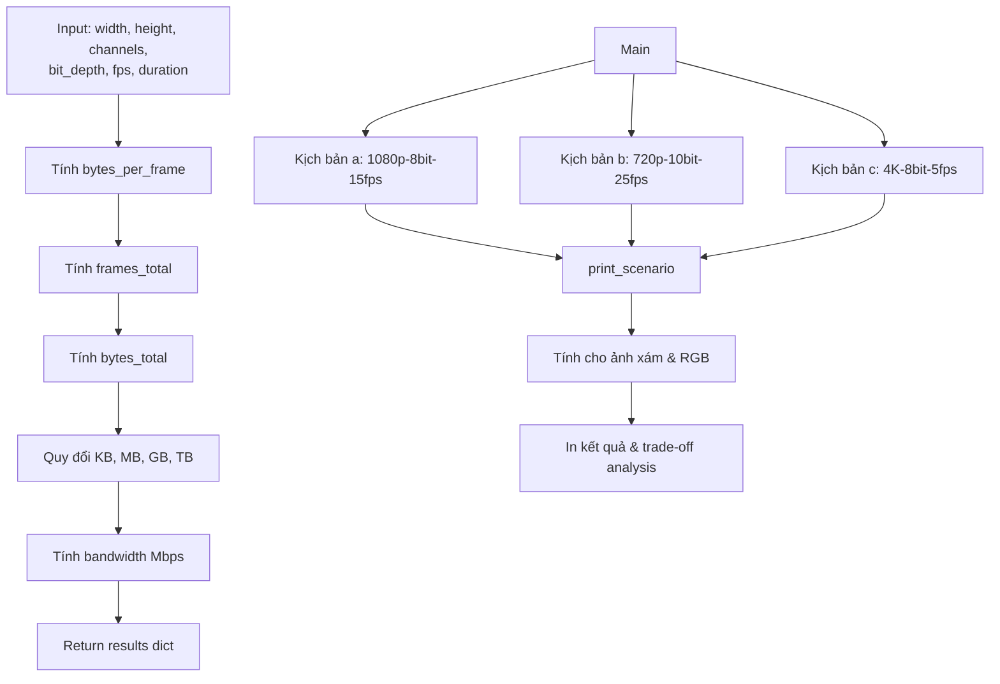

# Hướng Dẫn Đọc Code: Bài 1 - Camera Storage Calculator

## Mục Tiêu Bài Tập

- Tính toán **dung lượng lưu trữ** cho hệ thống camera giám sát
- Tính **băng thông** cần thiết cho truyền video
- Hiểu trade-off giữa **độ phân giải không gian** (spatial) và **độ phân giải mức xám** (gray-level)
- So sánh các kịch bản: 1080p-8bit-15fps, 720p-10bit-25fps, 4K-8bit-5fps
- Ứng dụng: Thiết kế hệ thống giám sát hành lang trường học

## Kỹ Thuật Chính

- **Tính kích thước frame**: `pixels × channels × bit_depth / 8`
- **Tính dung lượng**: `bytes_per_frame × fps × duration`
- **Tính băng thông**: `bytes_per_frame × fps × 8 / (1024²)` Mbps
- **Quy đổi đơn vị**: KB, MB, GB, TB
- **Trade-off analysis**: Resolution vs bit-depth vs fps vs storage

## File Code

`code-implement/T1-bieu-dien-va-thu-nhan-anh/bai-tap-1-camera-storage/calculator.py`

## Sơ Đồ Luồng Xử Lý



## Đọc Code Theo Thứ Tự

### Bước 1: Hàm calculate_storage() (Dòng 10-59)

**Input parameters**:
```python
def calculate_storage(width, height, channels, bit_depth, fps, duration_days):
```
- `width, height`: Độ phân giải (pixels)
- `channels`: 1=xám, 3=RGB
- `bit_depth`: 8, 10, 12 bits
- `fps`: Frames per second
- `duration_days`: Thời gian lưu (ngày)

**Công thức tính toán**:

**1. Kích thước 1 frame** (dòng 26-28):
```python
pixels_per_frame = width * height
bits_per_pixel = channels * bit_depth
bytes_per_frame = (pixels_per_frame * bits_per_pixel) / 8
```

**Ví dụ** với 1080p RGB 8-bit:
- `pixels_per_frame = 1920 × 1080 = 2,073,600`
- `bits_per_pixel = 3 × 8 = 24 bits`
- `bytes_per_frame = 2,073,600 × 24 / 8 = 6,220,800 bytes = 6.2 MB`

**2. Tổng số frames** (dòng 31-33):
```python
frames_per_second = fps
frames_per_day = frames_per_second * 60 * 60 * 24
frames_total = frames_per_day * duration_days
```

**Ví dụ** với 15 fps, 30 ngày:
- `frames_per_day = 15 × 60 × 60 × 24 = 1,296,000 frames/day`
- `frames_total = 1,296,000 × 30 = 38,880,000 frames`

**3. Tổng dung lượng** (dòng 35):
```python
bytes_total = bytes_per_frame * frames_total
```

**4. Quy đổi đơn vị** (dòng 38-41):
```python
kb_total = bytes_total / 1024
mb_total = kb_total / 1024
gb_total = mb_total / 1024
tb_total = gb_total / 1024
```

**5. Băng thông** (dòng 44-45):
```python
bits_per_second = bytes_per_frame * fps * 8
mbps = bits_per_second / (1024 * 1024)
```

**Ví dụ** với 6.2 MB/frame, 15 fps:
- `bits_per_second = 6,220,800 × 15 × 8 = 746,496,000 bits/s`
- `mbps = 746,496,000 / (1024²) = 712 Mbps`

### Bước 2: Hàm print_scenario() (Dòng 61-84)

**Mục đích**: In kết quả cho 1 kịch bản

```python
def print_scenario(name, width, height, bit_depth, fps, days=30):
    # Tính cho ảnh xám
    result_gray = calculate_storage(width, height, 1, bit_depth, fps, days)
    print(f"Kích thước 1 frame: {result_gray['frame_size_kb']:.2f} KB")
    print(f"Dung lượng {days} ngày: {result_gray['total_gb']:.2f} GB")
    print(f"Băng thông cần thiết: {result_gray['bandwidth_mbps']:.2f} Mbps")

    # Tính cho ảnh RGB
    result_rgb = calculate_storage(width, height, 3, bit_depth, fps, days)
    print(f"Kích thước 1 frame: {result_rgb['frame_size_kb']:.2f} KB")
    print(f"Dung lượng {days} ngày: {result_rgb['total_gb']:.2f} GB")
    print(f"Băng thông cần thiết: {result_rgb['bandwidth_mbps']:.2f} Mbps")
```

### Bước 3: Main - Test 3 Kịch Bản (Dòng 86-96)

**Kịch bản a**: 1080p – 8 bit – 15 fps
```python
print_scenario("(a) 1080p – 8 bit – 15 fps", 1920, 1080, 8, 15)
```

**Kịch bản b**: 720p – 10 bit – 25 fps
```python
print_scenario("(b) 720p – 10 bit – 25 fps", 1280, 720, 10, 25)
```

**Kịch bản c**: 4K – 8 bit – 5 fps
```python
print_scenario("(c) 4K – 8 bit – 5 fps", 3840, 2160, 8, 5)
```

### Bước 4: Trade-off Analysis (Dòng 98-121)

**Phân tích** (dòng 102-120):
```python
print("""
Trade-off giữa độ phân giải không gian và độ phân giải mức xám:

1. Độ phân giải không gian (Spatial Resolution):
   - 4K > 1080p > 720p
   - Ảnh hưởng: Chi tiết không gian, khả năng phóng to
   - Tăng độ phân giải → tăng dung lượng theo tỷ lệ bình phương

2. Độ phân giải mức xám (Gray-level Resolution):
   - 12-bit > 10-bit > 8-bit
   - Ảnh hưởng: Độ chi tiết sắc độ, khả năng phân biệt màu
   - Tăng bit depth → tăng dung lượng tuyến tính

3. Lựa chọn tối ưu:
   - Giám sát thông thường: 720p/1080p - 8 bit - 15-25 fps
   - Cần chi tiết cao: 4K - 8 bit - 5-10 fps
   - Điều kiện ánh sáng thay đổi: 1080p - 10 bit - 15 fps
   - Quan trọng: Sử dụng nén (H.264/H.265) giảm 90-95% dung lượng
""")
```

## Các Đoạn Code Quan Trọng

### 1. Tính Bytes per Frame (Dòng 26-28)

```python
pixels_per_frame = width * height
bits_per_pixel = channels * bit_depth
bytes_per_frame = (pixels_per_frame * bits_per_pixel) / 8
```

**Tại sao chia 8?**
- 1 byte = 8 bits
- `bits_per_pixel` tính theo bits
- `bytes_per_frame` cần theo bytes

**Ví dụ chi tiết**:
- 1080p RGB 8-bit: 1920 × 1080 × 3 × 8 / 8 = 6,220,800 bytes
- 720p RGB 10-bit: 1280 × 720 × 3 × 10 / 8 = 2,764,800 bytes
- 4K Grayscale 8-bit: 3840 × 2160 × 1 × 8 / 8 = 8,294,400 bytes

### 2. Tính Frames Total (Dòng 31-33)

```python
frames_per_second = fps
frames_per_day = frames_per_second * 60 * 60 * 24
frames_total = frames_per_day * duration_days
```

**Phân tích**:
- `60`: Giây → phút
- `60`: Phút → giờ
- `24`: Giờ → ngày
- `60 × 60 × 24 = 86,400 giây/ngày`

**Ví dụ**:
- 15 fps: 15 × 86,400 = 1,296,000 frames/ngày
- 25 fps: 25 × 86,400 = 2,160,000 frames/ngày

### 3. Tính Bandwidth (Dòng 44-45)

```python
bits_per_second = bytes_per_frame * fps * 8
mbps = bits_per_second / (1024 * 1024)
```

**Giải thích**:
- `× 8`: bytes → bits
- `/ (1024²)`: bits/s → Mbps
- **Lưu ý**: 1 Mbps = 1024² bits/s (binary), không phải 10⁶

## Hiểu Sâu Hơn

### Câu hỏi 1: Tại sao tăng spatial resolution lại tăng dung lượng theo bình phương?

**Trả lời**:

**Spatial resolution = width × height**
- 720p: 1280 × 720 = 921,600 pixels
- 1080p: 1920 × 1080 = 2,073,600 pixels (×2.25)
- 4K: 3840 × 2160 = 8,294,400 pixels (×4 so với 1080p)

**Tăng linear** (2×) theo mỗi chiều → **Tăng quadratic** (4×) tổng pixels

**Ví dụ**:
- 720p → 1080p: 1.5× width, 1.5× height → 1.5² = 2.25× pixels
- 1080p → 4K: 2× width, 2× height → 2² = 4× pixels

### Câu hỏi 2: Tại sao tăng bit-depth lại tăng dung lượng tuyến tính?

**Trả lời**:

**Bit-depth không ảnh hưởng số pixels**:
- 8-bit: 1 pixel = 8 bits
- 10-bit: 1 pixel = 10 bits (×1.25)
- 12-bit: 1 pixel = 12 bits (×1.5)

**Tăng linear**: 10-bit = 1.25× dung lượng của 8-bit

**So sánh**:
- Spatial: Tăng 2× → dung lượng ×4 (quadratic)
- Bit-depth: Tăng 1.25× → dung lượng ×1.25 (linear)

**Kết luận**: Spatial resolution ảnh hưởng mạnh hơn!

### Câu hỏi 3: Compression giảm được bao nhiêu?

**Trả lời**:

**Uncompressed** (raw):
- 1080p RGB 8-bit 30fps: ~712 Mbps

**H.264 (AVC)**:
- High quality: 20-40 Mbps (~95% reduction)
- Medium quality: 10-20 Mbps
- Low quality: 5-10 Mbps

**H.265 (HEVC)**:
- High quality: 10-20 Mbps (~97% reduction)
- 50% smaller than H.264 for same quality

**Ví dụ thực tế**:
- YouTube 1080p: 8 Mbps (H.264)
- Netflix 4K: 25 Mbps (H.265)
- Raw 4K 30fps: ~3000 Mbps

**Kết luận**: Compression giảm 90-98%, QUAN TRỌNG!

### Câu hỏi 4: Kịch bản nào tốt nhất cho giám sát hành lang?

**Trả lời**:

**Phân tích từng kịch bản**:

**Kịch bản a: 1080p – 8 bit – 15 fps**
- ✅ Độ phân giải tốt (nhận diện khuôn mặt được)
- ✅ Bit-depth đủ (8-bit standard)
- ✅ FPS chấp nhận được (15 fps cho giám sát)
- ✅ Dung lượng vừa phải
- → **CHỌN** cho hành lang thông thường

**Kịch bản b: 720p – 10 bit – 25 fps**
- ⚠️ Độ phân giải thấp hơn
- ✅ 10-bit tốt cho ánh sáng thay đổi
- ✅ 25 fps mượt mà
- → Chọn nếu điều kiện ánh sáng kém

**Kịch bản c: 4K – 8 bit – 5 fps**
- ✅ Độ phân giải rất cao (zoom in được)
- ❌ 5 fps quá thấp (có thể miss events)
- ❌ Dung lượng rất lớn
- → Chỉ dùng cho surveillance quan trọng

**Khuyến nghị**: **Kịch bản a** (1080p-8bit-15fps) với H.264 compression.

## Thử Nghiệm

### 1. Tính cho các resolution khác

```python
# 2K
print_scenario("2K – 8 bit – 24 fps", 2560, 1440, 8, 24)

# 8K
print_scenario("8K – 8 bit – 30 fps", 7680, 4320, 8, 30)
```

### 2. So sánh với compression

```python
# Thêm compression ratio
compression_ratio = 0.05  # H.264 giảm 95%
compressed_gb = result_rgb['total_gb'] * compression_ratio
print(f"Với H.264 compression: {compressed_gb:.2f} GB")
```

### 3. Tính chi phí storage

```python
# Giá HDD: $20/TB
price_per_tb = 20
storage_cost = result_rgb['total_tb'] * price_per_tb
print(f"Chi phí storage: ${storage_cost:.2f}")
```

## Kết Quả Mẫu

**Kịch bản a: 1080p – 8 bit – 15 fps (30 ngày)**

Ảnh xám:
- Kích thước 1 frame: 2.07 MB
- Dung lượng 30 ngày: 77.76 GB
- Băng thông: 237 Mbps

Ảnh RGB:
- Kích thước 1 frame: 6.22 MB
- Dung lượng 30 ngày: 233.28 GB
- Băng thông: 712 Mbps

**Với H.264 (95% reduction)**:
- 233.28 GB → ~12 GB
- 712 Mbps → ~36 Mbps

## Common Pitfalls

### 1. Quên chia 8 (bits → bytes)

```python
# SAI
bytes_per_frame = pixels_per_frame * bits_per_pixel

# ĐÚNG
bytes_per_frame = (pixels_per_frame * bits_per_pixel) / 8
```

### 2. Nhầm lẫn Mbps và MBps

- **Mbps**: Megabits per second (băng thông network)
- **MBps**: Megabytes per second (transfer rate)
- **Quy đổi**: 1 MBps = 8 Mbps

### 3. Quên compression trong thực tế

Dung lượng tính ra là **uncompressed**, thực tế nhỏ hơn 10-20 lần!

## Tham Khảo

**Theory**:
- `documents/T1-bieu-dien-va-thu-nhan-anh/theory/01-sampling-quantization.md`

**Standards**:
- H.264/AVC: ISO/IEC 14496-10
- H.265/HEVC: ISO/IEC 23008-2

**Applications**:
- CCTV system design
- Video streaming
- Camera specification

## Checklist Hiểu Bài

- [ ] Tính kích thước 1 frame (pixels × channels × bit_depth / 8)
- [ ] Tính tổng frames (fps × 86400 × days)
- [ ] Tính dung lượng (bytes_per_frame × frames_total)
- [ ] Quy đổi đơn vị (KB, MB, GB, TB)
- [ ] Tính băng thông (bits/s → Mbps)
- [ ] Hiểu trade-off spatial vs gray-level
- [ ] Giải thích tại sao spatial tăng theo bình phương
- [ ] Áp dụng compression ratio vào tính toán
- [ ] Chọn kịch bản phù hợp cho ứng dụng cụ thể

---

**Lưu ý**: Bài này đơn giản nhưng quan trọng, giúp hiểu cơ bản về storage và bandwidth trong video systems.
