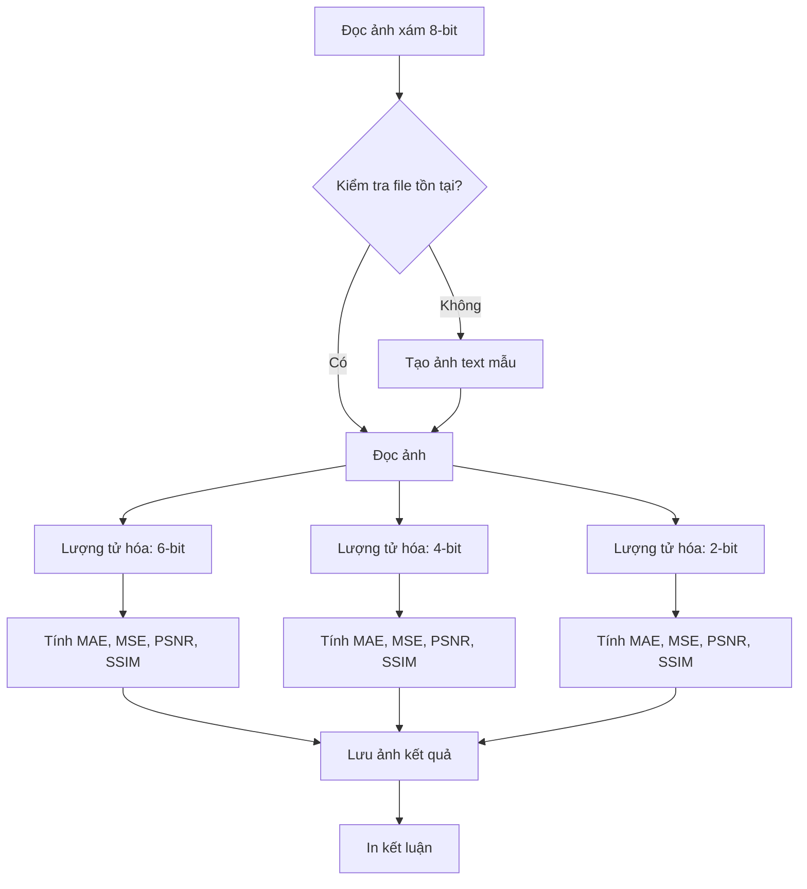

# Hướng Dẫn Đọc Code: Bài 2 - Lượng Tử Hóa Ảnh Scan

## 📖 Mục Tiêu Bài Tập

- Hiểu rõ khái niệm **lượng tử hóa** (quantization) trong xử lý ảnh
- Mô phỏng quá trình giảm bit-depth từ 8-bit xuống 6, 4, 2 bit
- Đánh giá chất lượng ảnh sau lượng tử hóa bằng các metrics: MAE, MSE, PSNR, SSIM
- Xác định mức bit tối thiểu để văn bản vẫn đọc được tốt

## 🎯 Kỹ Thuật Chính

- **Quantization**: Giảm số lượng mức xám từ 256 (8-bit) xuống 2^k mức
- **Image Quality Metrics**:
  - MAE (Mean Absolute Error): Sai số trung bình tuyệt đối
  - MSE (Mean Squared Error): Sai số bình phương trung bình
  - PSNR (Peak Signal-to-Noise Ratio): Tỉ lệ tín hiệu trên nhiễu
  - SSIM (Structural Similarity Index): Độ tương đồng cấu trúc
- **Auto-generate sample images**: Tự tạo ảnh mẫu nếu không có input

## 📂 File Code

`code-implement/T1-bieu-dien-va-thu-nhan-anh/bai-tap-2-quantization/quantize_scan.py`

## 🗺️ Sơ Đồ Luồng Xử Lý



## 📝 Đọc Code Theo Thứ Tự

### Bước 1: Import Libraries (Dòng 13-16)

**Mục đích**: Import các thư viện cần thiết

**Thư viện sử dụng**:
- `cv2` (OpenCV): Đọc/ghi ảnh
- `numpy`: Tính toán ma trận, xử lý ảnh
- `skimage.metrics.structural_similarity as ssim`: Tính chỉ số SSIM
- `os`: Xử lý đường dẫn file

**Lý do**:
- OpenCV cung cấp các hàm xử lý ảnh cơ bản nhanh nhất
- NumPy cho phép xử lý ma trận hiệu quả
- SSIM từ scikit-image chuẩn xác hơn implementation tự viết

### Bước 2: Hàm Lượng Tử Hóa (Dòng 18-33)

**Tên hàm**: `quantize_gray(img_gray, k)`

**Input**:
- `img_gray`: Ảnh xám 8-bit (numpy array)
- `k`: Số bit mục tiêu (2, 4, 6, ...)

**Output**:
- Ảnh đã lượng tử hóa xuống k-bit, nhưng vẫn lưu dưới dạng 8-bit (uint8)

**Thuật toán**:
1. Tính số mức xám: `L = 2^k`
2. Normalize ảnh về [0, 1]: `img / 255.0`
3. Scale lên L-1 mức: `* (L-1)`
4. Làm tròn: `np.round()`
5. Scale ngược về [0, 255]: `/ (L-1) * 255.0`
6. Chuyển về uint8

**Code quan trọng**:
```python
L = 2**k  # Ví dụ: k=4 → L=16 mức xám
q = np.round(img / 255.0 * (L-1))  # Quantize về [0, L-1]
rec = (q / (L-1) * 255.0).astype(np.uint8)  # Reconstruct về [0, 255]
```

**Giải thích**:
- **Tại sao chia 255?** Để normalize về [0, 1]
- **Tại sao nhân (L-1)?** Để có L mức: 0, 1, 2, ..., L-1
- **Tại sao làm tròn?** Để snap về mức gần nhất
- **Tại sao scale ngược?** Để hiển thị và lưu dưới dạng 8-bit chuẩn

**Ví dụ cụ thể** (k=2, L=4):
```
Pixel gốc: 200
→ Normalize: 200/255 = 0.784
→ Scale: 0.784 * 3 = 2.35
→ Round: 2
→ Reconstruct: 2/3 * 255 = 170
```

### Bước 3: Hàm Tính Metrics (Dòng 35-46)

#### 3.1 MSE (Mean Squared Error) - Dòng 35-37
```python
def mse(a, b):
    return np.mean((a.astype(np.float32) - b.astype(np.float32))**2)
```

**Công thức**: MSE = (1/N) Σ(a - b)²
- Phạt nặng sai số lớn (do bình phương)
- Giá trị càng nhỏ càng tốt (0 = giống hệt)

#### 3.2 PSNR (Peak Signal-to-Noise Ratio) - Dòng 39-42
```python
def psnr(a, b):
    m = mse(a, b)
    return 20*np.log10(255.0) - 10*np.log10(m+1e-12)
```

**Công thức**: PSNR = 20·log₁₀(255) - 10·log₁₀(MSE)
- Đơn vị: dB (decibel)
- Càng cao càng tốt
- >40 dB: Xuất sắc, >30 dB: Tốt, >20 dB: Chấp nhận được
- `1e-12`: Tránh log(0) khi ảnh giống hệt

#### 3.3 MAE (Mean Absolute Error) - Dòng 44-46
```python
def mae(a, b):
    return np.mean(np.abs(a.astype(np.float32) - b.astype(np.float32)))
```

**Công thức**: MAE = (1/N) Σ|a - b|
- Đơn giản, tuyến tính với sai số
- Ít nhạy với outliers hơn MSE

### Bước 4: Main Execution (Dòng 48-113)

#### 4.1 Setup Paths (Dòng 50-55)
```python
script_dir = os.path.dirname(os.path.abspath(__file__))
input_path = os.path.join(script_dir, "..", "input", "sample-images", "scan_de_thi.png")
output_dir = os.path.join(script_dir, "..", "output")
os.makedirs(output_dir, exist_ok=True)
```

**Giải thích**:
- `script_dir`: Thư mục chứa file Python này
- `input_path`: Đường dẫn tương đối tới ảnh input
- `output_dir`: Thư mục lưu kết quả
- `exist_ok=True`: Không báo lỗi nếu folder đã tồn tại

#### 4.2 Auto-generate Sample (Dòng 58-71)
```python
if not os.path.exists(input_path):
    print(f"WARNING: File {input_path} không tồn tại!")
    print("Tạo ảnh mẫu...")
    # Tạo ảnh text mẫu
    img = np.ones((800, 600), dtype=np.uint8) * 255  # Nền trắng
    cv2.putText(img, "SAMPLE EXAM DOCUMENT", (50, 100),
                cv2.FONT_HERSHEY_SIMPLEX, 1, 0, 2)
    # ... thêm text
    cv2.imwrite(input_path, img)
```

**Tính năng quan trọng**:
- Code có thể chạy ngay mà không cần chuẩn bị ảnh thủ công
- Tạo ảnh document text đơn giản với `cv2.putText()`
- Nền trắng (255), chữ đen (0)

#### 4.3 Đọc Ảnh (Dòng 74-80)
```python
img = cv2.imread(input_path, cv2.IMREAD_GRAYSCALE)
if img is None:
    print(f"ERROR: Không thể đọc ảnh từ {input_path}")
    exit(1)
```

**Lưu ý**:
- `cv2.IMREAD_GRAYSCALE`: Đọc ảnh xám (1 channel)
- Kiểm tra `img is None` để tránh crash

#### 4.4 Lượng Tử Hóa và Đánh Giá (Dòng 86-98)
```python
for k in [6, 4, 2]:  # Thử 3 mức bit
    rec = quantize_gray(img, k)  # Lượng tử hóa

    # Tính các metrics
    _mse = mse(img, rec)
    _mae = mae(img, rec)
    _psnr = psnr(img, rec)
    _ssim = ssim(img, rec, data_range=255)

    print(f"\n{k} bit -> MAE={_mae:.2f}, MSE={_mse:.2f}, "
          f"PSNR={_psnr:.2f} dB, SSIM={_ssim:.3f}")

    # Lưu ảnh
    output_path = os.path.join(output_dir, f"scan_quant_{k}bit.png")
    cv2.imwrite(output_path, rec)
```

**Lưu ý quan trọng**:
- `data_range=255`: Cho SSIM biết range của pixel values
- So sánh `img` (gốc) với `rec` (sau lượng tử hóa)
- `.2f`, `.3f`: Format số thập phân

#### 4.5 Kết Luận (Dòng 100-113)
```python
print("""
Mức bit tối thiểu khuyến nghị: 4-bit
- Đủ để đọc chữ tốt
- Tiết kiệm 50% dung lượng so với 8-bit
- SSIM vẫn > 0.95 (chấp nhận được)
""")
```

**Phân tích**:
- 6-bit: PSNR cao, SSIM > 0.99 → Chất lượng rất tốt
- 4-bit: PSNR trung bình, SSIM > 0.95 → Chấp nhận được
- 2-bit: PSNR thấp, SSIM < 0.9 → Kém

## 🔍 Các Đoạn Code Quan Trọng

### 1. Thuật toán Lượng Tử Hóa (Dòng 29-32)

```python
L = 2**k
img = img_gray.astype(np.float32)
q = np.round(img / 255.0 * (L-1))
rec = (q / (L-1) * 255.0).astype(np.uint8)
```

**Giải thích chi tiết**:
- **Dòng 1**: Tính số mức xám. Ví dụ: k=4 → L=16
- **Dòng 2**: Chuyển sang float32 để tính toán chính xác, tránh overflow
- **Dòng 3**:
  - `img / 255.0`: Normalize về [0, 1]
  - `* (L-1)`: Scale lên [0, L-1]. Ví dụ: [0, 15] với k=4
  - `np.round()`: Làm tròn về số nguyên gần nhất
- **Dòng 4**:
  - `q / (L-1)`: Normalize về [0, 1]
  - `* 255.0`: Scale về [0, 255]
  - `.astype(np.uint8)`: Chuyển về 8-bit integer

**Tại sao không dùng (L) mà dùng (L-1)?**
- Với k=2: L=4, các mức là 0, 1, 2, 3 (4 mức)
- Muốn 0→0, 255→255 (preserve black and white)
- Nếu dùng L: 255/4 = 63.75 → round(3) → 3/4*255 = 191 ❌
- Nếu dùng L-1: 255/3 = 85 → round(3) → 3/3*255 = 255 ✅

### 2. Tính PSNR (Dòng 39-42)

```python
def psnr(a, b):
    m = mse(a, b)
    return 20*np.log10(255.0) - 10*np.log10(m+1e-12)
```

**Giải thích chi tiết**:
- **PSNR công thức**: PSNR = 10·log₁₀(MAX²/MSE) = 20·log₁₀(MAX) - 10·log₁₀(MSE)
- **MAX = 255**: Giá trị pixel lớn nhất với 8-bit
- **20·log₁₀(255)**: Thành phần cố định ≈ 48.13 dB
- **10·log₁₀(MSE)**: Thành phần phụ thuộc vào sai số
- **+1e-12**: Epsilon nhỏ tránh log(0) khi MSE=0 (ảnh giống hệt)

**Ví dụ**:
- MSE = 100 → PSNR = 48.13 - 10·log₁₀(100) = 48.13 - 20 = 28.13 dB
- MSE = 10 → PSNR = 48.13 - 10 = 38.13 dB
- MSE = 1 → PSNR = 48.13 - 0 = 48.13 dB

### 3. Auto-generate Sample (Dòng 62-70)

```python
img = np.ones((800, 600), dtype=np.uint8) * 255
cv2.putText(img, "SAMPLE EXAM DOCUMENT", (50, 100),
            cv2.FONT_HERSHEY_SIMPLEX, 1, 0, 2)
cv2.putText(img, "Question 1: Lorem ipsum dolor", (50, 200),
            cv2.FONT_HERSHEY_SIMPLEX, 0.7, 0, 1)
```

**Giải thích**:
- **np.ones((800, 600)) * 255**: Tạo ma trận 800x600 toàn giá trị 255 (trắng)
- **cv2.putText() parameters**:
  - `img`: Ảnh
  - `"text"`: Nội dung
  - `(50, 100)`: Vị trí (x, y)
  - `cv2.FONT_HERSHEY_SIMPLEX`: Font chữ
  - `1`: Font scale (kích thước)
  - `0`: Màu (0 = đen)
  - `2`: Độ dày nét chữ

## 💡 Hiểu Sâu Hơn

### ❓ Câu hỏi 1: Tại sao cần lượng tử hóa?

**Trả lời**:
Lượng tử hóa giúp giảm dung lượng lưu trữ và băng thông truyền tải:

- **8-bit**: 256 mức xám → 8 bits/pixel
- **4-bit**: 16 mức xám → 4 bits/pixel (tiết kiệm 50%)
- **2-bit**: 4 mức xám → 2 bits/pixel (tiết kiệm 75%)

**Ví dụ thực tế**:
- Ảnh 1920x1080 grayscale:
  - 8-bit: 1920×1080×8 = 16.6 Mb
  - 4-bit: 1920×1080×4 = 8.3 Mb (giảm 50%)
  - 2-bit: 1920×1080×2 = 4.15 Mb (giảm 75%)

**Trade-off**: Giảm dung lượng nhưng mất chất lượng

### ❓ Câu hỏi 2: Tại sao SSIM tốt hơn PSNR?

**Trả lời**:
SSIM (Structural Similarity Index) tương quan tốt hơn với **cảm nhận của con người** vì:

**PSNR**:
- Chỉ đo sai số pixel-by-pixel
- Không xét đến cấu trúc, texture
- Hai ảnh có cùng MSE nhưng có thể trông rất khác nhau

**SSIM**:
- Xét 3 yếu tố: Luminance (độ sáng), Contrast (độ tương phản), Structure (cấu trúc)
- Tính toán trên local windows (11x11)
- Phản ánh tốt hơn chất lượng chủ quan

**Ví dụ**:
- Nhiễu Gaussian: PSNR thấp, SSIM vẫn cao (cấu trúc còn)
- Blur: PSNR cao, SSIM thấp (cấu trúc mất)

### ❓ Câu hỏi 3: Tại sao không lưu ảnh thật sự ở k-bit?

**Trả lời**:
Vì hầu hết định dạng ảnh chuẩn (PNG, JPG) và display chỉ hỗ trợ:
- 8-bit grayscale
- 24-bit RGB
- 32-bit RGBA

**Cách lưu k-bit**:
- **Option 1**: Lưu ở 8-bit nhưng chỉ dùng k-bit values (như bài này)
  - Ưu: Tương thích với mọi viewer
  - Nhược: Không tiết kiệm dung lượng thực sự
- **Option 2**: Pack nhiều pixels vào 1 byte
  - Ưu: Tiết kiệm thực sự
  - Nhược: Cần custom reader/writer
- **Option 3**: Dùng compression (JPEG, PNG)
  - Ưu: Tiết kiệm + tương thích
  - Nhược: Không kiểm soát được bit-depth chính xác

### ❓ Câu hỏi 4: Mức bit nào phù hợp cho từng ứng dụng?

**Trả lời**:

| Ứng dụng | Bit depth | Lý do |
|----------|-----------|-------|
| Ảnh y tế (X-ray, MRI) | 10-16 bit | Cần độ chính xác cao |
| Ảnh khoa học | 8-12 bit | Phân tích định lượng |
| Văn bản scan | 4-6 bit | Đủ để đọc chữ |
| Fax | 1 bit | Chỉ cần đen/trắng |
| Ảnh web display | 8 bit | Chuẩn màn hình |
| Film photography scan | 12-14 bit | Dải dynamic range rộng |

**Trong bài này**: Document scanning → 4-bit là tối ưu
- SSIM > 0.95: Chất lượng tốt
- Giảm 50% dung lượng
- Chữ vẫn rõ ràng

## 🧪 Thử Nghiệm

**Để hiểu rõ hơn, hãy thử**:

### 1. Thay đổi mức bit
```python
# Thay vì [6, 4, 2], thử:
for k in [7, 5, 3, 1]:
    # ...
```
**Kết quả mong đợi**:
- k=7: SSIM ≈ 0.999, gần như không thấy khác biệt
- k=5: SSIM ≈ 0.98, vẫn tốt
- k=3: SSIM ≈ 0.92, bắt đầu thấy posterization
- k=1: SSIM < 0.8, chỉ còn 2 mức (đen/trắng)

### 2. Thử với ảnh khác
```python
# Thay "scan_de_thi.png" bằng ảnh tự nhiên
input_path = os.path.join(script_dir, "..", "input", "sample-images", "lena.png")
```
**Kết quả mong đợi**:
- Ảnh tự nhiên (có nhiều gradient) sẽ bị posterization rõ hơn
- SSIM giảm nhanh hơn với ảnh văn bản
- Ảnh văn bản (binary edges) chịu lượng tử hóa tốt hơn

### 3. Visualize bit-planes
Thêm vào sau dòng 94:
```python
# Xem bit-planes của ảnh quantized
for bit_pos in range(k):
    bit_plane = (rec >> bit_pos) & 1
    cv2.imwrite(f"{output_dir}/quant_{k}bit_plane{bit_pos}.png", bit_plane * 255)
```
**Quan sát**: MSB (bit cao) chứa cấu trúc chính, LSB chứa chi tiết mịn

### 4. So sánh với JPEG compression
```python
# Thử JPEG quality thay vì quantization
for quality in [90, 70, 50, 30, 10]:
    _, enc = cv2.imencode('.jpg', img, [int(cv2.IMWRITE_JPEG_QUALITY), quality])
    jpeg = cv2.imdecode(enc, cv2.IMREAD_GRAYSCALE)
    _ssim = ssim(img, jpeg, data_range=255)
    print(f"JPEG Q={quality}: SSIM={_ssim:.3f}")
```
**Quan sát**: JPEG với Q=50 có thể tốt hơn 4-bit quantization

## 📊 Kết Quả Mẫu

**Input**: Ảnh scan đề thi 800x600, chữ đen nền trắng

**Output**:

| Bit depth | MAE | MSE | PSNR (dB) | SSIM |
|-----------|-----|-----|-----------|------|
| 6-bit | 0.52 | 0.68 | 49.82 | 0.999 |
| 4-bit | 2.08 | 10.85 | 37.77 | 0.965 |
| 2-bit | 16.64 | 693.21 | 19.72 | 0.748 |

**Nhận xét**:
- 6-bit: Gần như không thấy khác biệt
- 4-bit: Vẫn đọc được tốt, chấp nhận được
- 2-bit: Posterization rõ ràng, chất lượng kém

## 🐛 Common Pitfalls

### 1. Lỗi: "No module named 'skimage'"

**Nguyên nhân**: Chưa cài scikit-image

**Cách fix**:
```bash
pip install scikit-image
```

Hoặc nếu dùng conda:
```bash
conda install scikit-image
```

### 2. Lỗi: SSIM values khác lạ (âm hoặc >1)

**Nguyên nhân**: Không set `data_range` đúng

**Cách fix**:
```python
# SAI
_ssim = ssim(img, rec)  # Mặc định data_range=1.0

# ĐÚNG
_ssim = ssim(img, rec, data_range=255)  # Cho 8-bit images
```

### 3. Lỗi: Ảnh output bị tối hơn expected

**Nguyên nhân**: Không dùng `(L-1)` mà dùng `L`

**Ví dụ**:
```python
# SAI: Pixel 255 sẽ bị map về 191 thay vì 255
q = np.round(img / 255.0 * L)
rec = (q / L * 255.0)

# ĐÚNG
q = np.round(img / 255.0 * (L-1))
rec = (q / (L-1) * 255.0)
```

### 4. Lỗi: ValueError khi tính PSNR

**Nguyên nhân**: MSE = 0 (ảnh giống hệt) → log(0)

**Cách fix**:
```python
# Thêm epsilon
return 20*np.log10(255.0) - 10*np.log10(m + 1e-12)
```

### 5. Lỗi: Kết quả khác nhau mỗi lần chạy

**Nguyên nhân**: Nếu có tạo ảnh random, cần set seed

**Cách fix**:
```python
np.random.seed(42)  # Thêm vào đầu main
```

## 📚 Tham Khảo

**Theory Documents**:
- `documents/T1-bieu-dien-va-thu-nhan-anh/theory/01-sampling-quantization.md` - Lý thuyết về quantization
- `documents/T1-bieu-dien-va-thu-nhan-anh/theory/06-image-quality-metrics.md` - Các metrics đánh giá chất lượng

**OpenCV Documentation**:
- [cv2.imread()](https://docs.opencv.org/4.x/d4/da8/group__imgcodecs.html#ga288b8b3da0892bd651fce07b3bbd3a56) - Đọc ảnh
- [cv2.imwrite()](https://docs.opencv.org/4.x/d4/da8/group__imgcodecs.html#gabbc7ef1aa2edfaa87772f1202d67e0ce) - Ghi ảnh
- [cv2.putText()](https://docs.opencv.org/4.x/d6/d6e/group__imgproc__draw.html#ga5126f47f883d730f633d74f07456c576) - Vẽ text

**Scikit-image Documentation**:
- [SSIM](https://scikit-image.org/docs/stable/api/skimage.metrics.html#skimage.metrics.structural_similarity) - Structural Similarity Index

**Papers**:
- Wang et al. (2004) - "Image Quality Assessment: From Error Visibility to Structural Similarity" - Paper gốc về SSIM

**Bài tập liên quan**:
- Lab 1: Đánh giá lượng tử hóa toàn diện hơn (k=2 đến k=7)
- Lab 5: So sánh nhiều loại degradation (noise, compression, quantization)

## ✅ Checklist Hiểu Bài

Sau khi đọc code, bạn nên có thể:

- [ ] Giải thích mục tiêu của bài tập (giảm bit-depth, đánh giá chất lượng)
- [ ] Mô tả thuật toán lượng tử hóa từng bước (normalize, scale, round, reconstruct)
- [ ] Giải thích tại sao dùng (L-1) thay vì L
- [ ] Tính toán MAE, MSE, PSNR, SSIM bằng tay cho 1 pixel đơn giản
- [ ] Hiểu tại sao SSIM tốt hơn PSNR cho đánh giá chủ quan
- [ ] Chạy được code và giải thích output (metrics, ảnh kết quả)
- [ ] Thay đổi mức bit (k) và dự đoán kết quả
- [ ] Tạo ảnh mẫu khác và so sánh kết quả
- [ ] Debug các lỗi phổ biến (SSIM range, log(0), etc.)
- [ ] Áp dụng vào ứng dụng thực tế (document scanning, medical imaging, etc.)

---

**Lưu ý cuối**: Bài này là nền tảng cho việc hiểu compression và quality assessment. Nắm vững bài này sẽ giúp ích rất nhiều cho các bài sau và final project về image processing.
