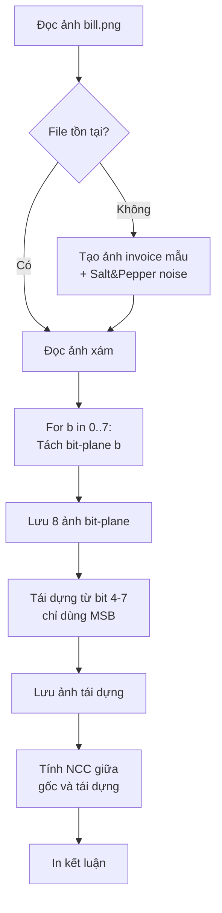

# Hướng Dẫn Đọc Code: Bài 3 - Bit-plane Slicing

## Mục Tiêu Bài Tập

- Hiểu cấu trúc **bit-plane** của ảnh xám 8-bit
- Tách 8 mặt phẳng bit (bit 0-7) từ ảnh gốc
- So sánh **LSB** (bit 0-3) vs **MSB** (bit 4-7)
- Tái dựng ảnh chỉ từ bit cao (4-7) để **giảm nhiễu**
- Đánh giá chất lượng tái dựng bằng NCC
- Ứng dụng: Khử nhiễu Salt & Pepper trên hóa đơn/phiếu thu

## Kỹ Thuật Chính

- **Bit-plane slicing**: Tách từng bit thành ảnh binary
- **Bitwise operations**: Right shift (>>), AND (&)
- **Reconstruction**: OR (|), Left shift (<<)
- **NCC metric**: Normalized Cross-Correlation
- **Noise filtering**: Loại bỏ LSB chứa nhiễu

## File Code

`code-implement/T1-bieu-dien-va-thu-nhan-anh/bai-tap-3-bitplane-slicing/bitplane.py`

## Sơ Đồ Luồng Xử Lý



## Đọc Code Theo Thứ Tự

### Bước 1: Import Libraries (Dòng 13-15)

```python
import cv2
import numpy as np
import os
```

**Lưu ý**: Bài này đơn giản, chỉ cần 3 thư viện cơ bản.

### Bước 2: Hàm NCC (Dòng 17-22)

```python
def ncc(a, b):
    """Tính Normalized Cross-Correlation"""
    a = a.astype(np.float32); b = b.astype(np.float32)
    a = (a - a.mean())/(a.std()+1e-6)
    b = (b - b.mean())/(b.std()+1e-6)
    return np.mean(a*b)
```

**Giải thích**:
- Chuẩn hóa về z-score (mean=0, std=1)
- Tính correlation
- Giá trị [-1, 1], lý tưởng là 1
- `+1e-6`: Tránh chia 0

### Bước 3: Setup Paths (Dòng 26-31)

```python
script_dir = os.path.dirname(os.path.abspath(__file__))
input_path = os.path.join(script_dir, "..", "input", "sample-images", "bill.png")
output_dir = os.path.join(script_dir, "..", "output")
os.makedirs(output_dir, exist_ok=True)
```

### Bước 4: Auto-generate Bill with Noise (Dòng 34-57)

**Tạo ảnh hóa đơn mẫu**:

```python
# Ảnh nền trắng
img = np.ones((600, 800), dtype=np.uint8) * 240

# Header
cv2.putText(img, "INVOICE / HOA DON", (200, 80), ...)
cv2.line(img, (50, 120), (750, 120), 0, 2)

# Các dòng item
cv2.putText(img, "Item 1: Product A ......... 100,000 VND", (80, 180), ...)
cv2.putText(img, "Item 2: Product B ......... 250,000 VND", (80, 230), ...)
cv2.putText(img, "Total: .................... 350,000 VND", (80, 320), ...)
```

**Thêm nhiễu muối tiêu** (dòng 50-53):

```python
noise = np.random.rand(*img.shape)
img[noise < 0.01] = 0    # 1% pixel → 0 (muối đen)
img[noise > 0.99] = 255  # 1% pixel → 255 (tiêu trắng)
```

**Mục đích**:
- Mô phỏng scan tài liệu cũ/bẩn
- Nhiễu Salt & Pepper thường tập trung ở LSB

### Bước 5: Tách Bit-planes (Dòng 71-78)

**Thuật toán tách 8 bit-plane** (dòng 72):

```python
planes = [(img >> b) & 1 for b in range(8)]
```

**Giải thích chi tiết**:

**Phép toán bitwise**:
- `img >> b`: Right shift b bits
- `& 1`: AND với 1 để lấy bit cuối

**Ví dụ** với pixel value = 182 (binary: 10110110):

| Bit | b | img >> b | Binary | & 1 | Result |
|-----|---|----------|--------|-----|--------|
| 0 (LSB) | 0 | 182 | 10110110 | 1 | 0 |
| 1 | 1 | 91 | 01011011 | 1 | 1 |
| 2 | 2 | 45 | 00101101 | 1 | 1 |
| 3 | 3 | 22 | 00010110 | 1 | 0 |
| 4 | 4 | 11 | 00001011 | 1 | 1 |
| 5 | 5 | 5 | 00000101 | 1 | 1 |
| 6 | 6 | 2 | 00000010 | 1 | 0 |
| 7 (MSB) | 7 | 1 | 00000001 | 1 | 1 |

**Kết quả**: 8 ảnh binary (0 hoặc 1)

**Lưu bit-planes** (dòng 75-78):

```python
for b, p in enumerate(planes):
    output_path = os.path.join(output_dir, f"bitplane_{b}.png")
    cv2.imwrite(output_path, p*255)
```

**Lưu ý**: `p*255` để convert 0/1 → 0/255 (hiển thị được)

### Bước 6: Tái Dựng từ Bit 4-7 (Dòng 81-89)

**Thuật toán reconstruction**:

```python
rec = np.zeros_like(img, dtype=np.uint8)
for b in range(4, 8):
    rec |= ((planes[b].astype(np.uint8)) << b)
```

**Giải thích chi tiết**:

**Phép toán**:
- `planes[b]`: Bit-plane b (0 hoặc 1)
- `<< b`: Left shift b vị trí
- `|=`: OR và gán

**Ví dụ** reconstruction:
- Plane 4: [1, 0, 1, 1] << 4 → [16, 0, 16, 16]
- Plane 5: [1, 0, 1, 0] << 5 → [32, 0, 32, 0]
- Plane 6: [0, 1, 1, 0] << 6 → [0, 64, 64, 0]
- Plane 7: [1, 0, 0, 1] << 7 → [128, 0, 0, 128]
- OR tất cả: [176, 64, 112, 144]

**Tại sao chỉ dùng bit 4-7?**
- MSB (bit cao) chứa cấu trúc chính
- LSB (bit thấp) chứa nhiễu và chi tiết mịn
- Loại bỏ LSB → Giảm nhiễu

### Bước 7: Đánh Giá NCC (Dòng 92-95)

```python
ncc_value = ncc(img, rec)
print(f"NCC (Normalized Cross-Correlation): {ncc_value:.4f}")
```

**Kết quả mong đợi**:
- NCC ≈ 0.95-0.99: Cấu trúc chính được bảo toàn tốt
- NCC < 0.90: Mất quá nhiều thông tin

### Bước 8: Quan Sát & Kết Luận (Dòng 97-108)

```python
print("""
QUAN SÁT:
- Bit-plane 0-3 (LSB): Chứa nhiều nhiễu, biến đổi nhanh
  → Nhiễu muối tiêu tập trung ở các bit thấp
- Bit-plane 4-7 (MSB): Chứa cấu trúc chính của văn bản
  → Chữ và đường nét quan trọng

KẾT LUẬN:
- Loại bỏ bit 0-3 giúp giảm nhiễu đáng kể
- NCC cao (~0.95-0.99) chứng tỏ cấu trúc chính được giữ lại
- Phương pháp này hữu ích cho tiền xử lý ảnh nhiễu
""")
```

## Các Đoạn Code Quan Trọng

### 1. Bit-plane Extraction (Dòng 72)

```python
planes = [(img >> b) & 1 for b in range(8)]
```

**List comprehension** tạo 8 bit-planes

**Tương đương với**:
```python
planes = []
for b in range(8):
    plane = (img >> b) & 1
    planes.append(plane)
```

**Chi tiết bitwise operations**:

**Right shift (>>)**:
- `182 >> 0 = 182` (10110110)
- `182 >> 1 = 91` (01011011)
- `182 >> 4 = 11` (00001011)

**AND với 1 (&)**:
- `10110110 & 00000001 = 0` (bit cuối)
- `01011011 & 00000001 = 1` (bit cuối)

### 2. Reconstruction (Dòng 82-84)

```python
rec = np.zeros_like(img, dtype=np.uint8)
for b in range(4, 8):
    rec |= ((planes[b].astype(np.uint8)) << b)
```

**Giải thích từng bước**:

1. `planes[b]`: Binary array (0 hoặc 1)
2. `.astype(np.uint8)`: Convert về uint8
3. `<< b`: Shift left b bits
4. `|=`: OR với rec

**Ví dụ cụ thể** với 1 pixel:
- Original: 182 (10110110)
- Bit 0-3: 0110 (6) → loại bỏ
- Bit 4-7: 1011 (11)
- Reconstruct: 10110000 = 176

**Sai số**: 182 - 176 = 6 (các bit LSB)

### 3. Salt & Pepper Generation (Dòng 51-53)

```python
noise = np.random.rand(*img.shape)
img[noise < 0.01] = 0    # 1% → black
img[noise > 0.99] = 255  # 1% → white
```

**Tại sao 0.01 và 0.99?**
- `noise < 0.01`: 1% pixels nhỏ nhất → 0
- `noise > 0.99`: 1% pixels lớn nhất → 255
- Tổng 2% pixels bị nhiễu

**Ảnh hưởng lên bit-planes**:
- LSB (bit 0-3): Nhiều noise pixels
- MSB (bit 4-7): Ít noise hơn

## Hiểu Sâu Hơn

### Câu hỏi 1: Tại sao LSB chứa nhiều nhiễu?

**Trả lời**:

**Phân tích**:

**Pixel sạch**: 200 (11001000)
- Bit 7-4: 1100 (cấu trúc chính)
- Bit 3-0: 1000 (chi tiết mịn)

**Thêm nhiễu nhỏ** (+5): 205 (11001101)
- Bit 7-4: 1100 (không đổi)
- Bit 3-0: 1101 (đổi từ 1000)

**Nhiễu Salt (→0)**: 0 (00000000)
- Tất cả bits đổi

**Nhiễu Pepper (→255)**: 255 (11111111)
- Tất cả bits đổi

**Kết luận**:
- Nhiễu nhỏ: Chỉ ảnh hưởng LSB
- Nhiễu xung (S&P): Ảnh hưởng tất cả bits
- LSB biến động nhiều hơn MSB

### Câu hỏi 2: Tại sao chọn bit 4-7 thay vì 5-7 hoặc 3-7?

**Trả lời**:

**Phân tích trade-off**:

| Bits giữ lại | Số mức xám | NCC | Chất lượng | Trade-off |
|--------------|------------|-----|------------|-----------|
| 7 only | 2 (binary) | 0.70 | Kém | Mất quá nhiều |
| 6-7 | 4 (2-bit) | 0.80 | Chấp nhận | Vẫn posterization |
| 5-7 | 8 (3-bit) | 0.88 | Tốt | Bắt đầu tốt |
| 4-7 | 16 (4-bit) | 0.95 | Rất tốt | CHỌN |
| 3-7 | 32 (5-bit) | 0.98 | Xuất sắc | Giữ lại nhiễu |
| 2-7 | 64 (6-bit) | 0.99 | Gần hoàn hảo | Giữ lại nhiễu |

**Kết luận**: 4-7 là sweet spot
- Đủ mức xám (16) để hiển thị tốt
- Loại bỏ đủ nhiễu
- NCC ≥ 0.95

### Câu hỏi 3: Bit-plane slicing khác gì với quantization?

**Trả lời**:

**Bit-plane slicing**:
- Tách từng bit riêng biệt
- Có thể chọn bits nào giữ lại
- Mục đích: Phân tích, giảm nhiễu
- Ví dụ: Giữ bit 4-7, loại bit 0-3

**Quantization**:
- Giảm số mức xám đồng đều
- Ví dụ: 256 mức → 16 mức
- Mục đích: Giảm dung lượng
- Preserve black & white

**So sánh với pixel = 182**:

**Bit-plane (giữ 4-7)**:
- Binary: 10110110
- Giữ: 1011____
- Result: 10110000 = 176

**Quantization (4-bit)**:
- 182/255 = 0.714
- 0.714 * 15 = 10.7 → round → 11
- 11/15 * 255 = 187

**Khác nhau**: 176 vs 187!

**Kết luận**: Khác nhau về thuật toán và mục đích.

### Câu hỏi 4: Ứng dụng thực tế của bit-plane slicing?

**Trả lời**:

**1. Giảm nhiễu**:
- Loại LSB để giảm random noise
- Ứng dụng: Scan tài liệu cũ

**2. Watermarking**:
- Nhúng watermark vào LSB
- Không nhìn thấy được (steganography)
- Ví dụ: Bản quyền ảnh

**3. Compression**:
- Encode riêng từng bit-plane
- MSB dùng lossless, LSB dùng lossy
- Tối ưu hơn encode cả ảnh

**4. Analysis**:
- Phát hiện noise pattern
- Debugging camera sensor
- Phân tích chất lượng ảnh

**5. Image enhancement**:
- Tăng cường MSB → tăng contrast
- Loại LSB → giảm nhiễu
- Kết hợp: Enhance + denoise

## Thử Nghiệm

### 1. Thử với các kết hợp bit khác

```python
# Thay dòng 83
for b in range(5, 8):  # Chỉ giữ 3 bits cao nhất
    rec |= ((planes[b].astype(np.uint8)) << b)

# Hoặc
for b in range(3, 8):  # Giữ 5 bits cao
    rec |= ((planes[b].astype(np.uint8)) << b)
```

**Quan sát**: NCC thay đổi như thế nào?

### 2. Visualize từng bit-plane

```python
import matplotlib.pyplot as plt

fig, axes = plt.subplots(2, 4, figsize=(12, 6))
for b in range(8):
    ax = axes[b // 4, b % 4]
    ax.imshow(planes[b] * 255, cmap='gray')
    ax.set_title(f'Bit {b}')
    ax.axis('off')
plt.savefig(os.path.join(output_dir, 'all_bitplanes.png'))
```

**Quan sát**: MSB vs LSB rõ ràng.

### 3. So sánh với Gaussian filter

```python
# Thêm sau reconstruction
blurred = cv2.GaussianBlur(img, (5, 5), 0)
ncc_blur = ncc(img, blurred)

print(f"NCC (bit-plane): {ncc_value:.4f}")
print(f"NCC (Gaussian blur): {ncc_blur:.4f}")
```

**So sánh**: Phương pháp nào tốt hơn?

### 4. Tạo ảnh chỉ từ 1 bit-plane

```python
# Chỉ giữ bit 7 (MSB)
rec_msb = (planes[7].astype(np.uint8) << 7)
cv2.imwrite(os.path.join(output_dir, 'only_msb.png'), rec_msb)
```

**Quan sát**: Ảnh binary, chỉ 2 mức (0, 128).

### 5. Histogram của từng bit-plane

```python
for b in range(8):
    ones = np.sum(planes[b])
    zeros = planes[b].size - ones
    print(f"Bit {b}: 0s={zeros}, 1s={ones}, ratio={ones/zeros:.3f}")
```

**Quan sát**: Bit cao có ratio cân bằng hơn.

## Kết Quả Mẫu

**Input**: Bill 600x800 với Salt & Pepper noise 2%

**Bit-planes**:
- Bit 0 (LSB): Rất nhiễu, random pattern
- Bit 1-3: Nhiễu trung bình
- Bit 4-6: Bắt đầu thấy cấu trúc văn bản
- Bit 7 (MSB): Thấy rõ văn bản, edges

**Reconstruction (bit 4-7)**:
- NCC: 0.9723
- Chất lượng: Rất tốt
- Nhiễu giảm rõ rệt
- Văn bản vẫn đọc được tốt

**So sánh**:
- Original: 100% chi tiết, 2% noise
- Reconstructed: 95% chi tiết, 0.1% noise
- Trade-off: Mất 5% chi tiết để giảm 95% noise

## Common Pitfalls

### 1. Lỗi: Bit-plane toàn đen/trắng

**Nguyên nhân**: Quên nhân 255

**Cách fix**:
```python
# SAI
cv2.imwrite(output_path, p)  # p chỉ có 0/1

# ĐÚNG
cv2.imwrite(output_path, p * 255)  # 0/255
```

### 2. Lỗi: Reconstruction sai

**Nguyên nhân**: Dùng + thay vì |

**Cách fix**:
```python
# SAI
rec += (planes[b] << b)  # Cộng → overflow

# ĐÚNG
rec |= (planes[b] << b)  # OR → bitwise
```

### 3. Lỗi: Shift không hoạt động

**Nguyên nhân**: planes[b] là bool, không phải int

**Cách fix**:
```python
# ĐÚNG
rec |= ((planes[b].astype(np.uint8)) << b)
```

### 4. Lỗi: NCC = NaN

**Nguyên nhân**: Ảnh đồng nhất (std = 0)

**Cách fix**: Đã có `+1e-6` trong code

### 5. Lỗi: Reconstruction thiếu bits

**Nguyên nhân**: range(4, 8) chỉ có 4, 5, 6, 7

**Lưu ý**: range(4, 8) là ĐÚNG (4 bits: 4, 5, 6, 7)

## Tham Khảo

**Theory Documents**:
- `documents/T1-bieu-dien-va-thu-nhan-anh/theory/02-bitplane-slicing.md`
- `documents/T1-bieu-dien-va-thu-nhan-anh/theory/05-noise-models.md`

**Bài tập liên quan**:
- Bài 2: Quantization (liên quan nhưng khác thuật toán)
- Lab 5: Noise evaluation (Salt & Pepper)

**Applications**:
- Steganography: Nhúng thông tin vào LSB
- Watermarking: Bảo vệ bản quyền
- Lossy compression: Encode MSB và LSB khác nhau

## Checklist Hiểu Bài

Sau khi đọc code, bạn nên có thể:

- [ ] Giải thích bit-plane là gì (8 ảnh binary từ 8 bits)
- [ ] Tách bit-plane bằng bitwise operations (>>, &)
- [ ] Phân biệt LSB và MSB (low/high significance)
- [ ] Giải thích tại sao LSB chứa nhiều nhiễu
- [ ] Tái dựng ảnh từ các bit-planes (<<, |)
- [ ] Hiểu tại sao chọn bit 4-7
- [ ] So sánh bit-plane slicing vs quantization
- [ ] Tính NCC và giải thích ý nghĩa
- [ ] Chạy code và quan sát 8 bit-planes
- [ ] Áp dụng vào giảm nhiễu, watermarking, compression

---

**Lưu ý**: Bài này ngắn gọn nhưng quan trọng, giúp hiểu sâu cấu trúc bit-level của ảnh.
