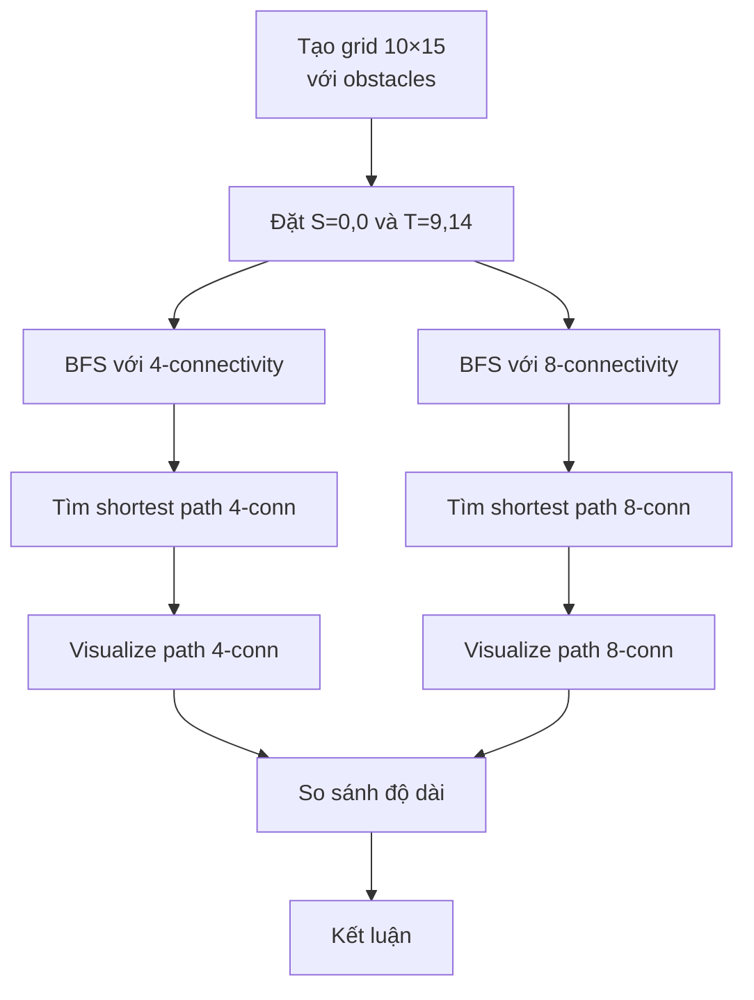

# Hướng Dẫn Đọc Code: Bài 4 - Connectivity & Pathfinding

## Mục Tiêu Bài Tập

- Hiểu khái niệm **4-connectivity** và **8-connectivity**
- Tìm đường đi ngắn nhất bằng **BFS** (Breadth-First Search)
- So sánh độ dài đường đi giữa 4-conn vs 8-conn
- Tính **Manhattan distance** (4-connectivity) và **Chessboard distance** (8-connectivity)
- Ứng dụng: Robot dọn lớp học tránh chướng ngại vật

## Kỹ Thuật Chính

- **4-connectivity**: 4 neighbors (trên, dưới, trái, phải)
- **8-connectivity**: 8 neighbors (thêm 4 góc chéo)
- **BFS**: Breadth-First Search để tìm đường ngắn nhất
- **Distance metrics**:
  - Manhattan: `|x1-x2| + |y1-y2|`
  - Chessboard: `max(|x1-x2|, |y1-y2|)`
  - Euclidean: `sqrt((x1-x2)² + (y1-y2)²)`
- **Path visualization**: Vẽ đường đi lên ảnh

## File Code

`code-implement/T1-bieu-dien-va-thu-nhan-anh/bai-tap-4-connectivity/robot_path.py`

## Sơ Đồ Luồng Xử Lý



## Đọc Code Theo Thứ Tự

### Bước 1: Hàm neighbors() (Dòng 17-31)

**Mục đích**: Lấy danh sách neighbors của 1 điểm

```python
def neighbors(p, conn='4'):
    x, y = p
    N4 = [(x+1, y), (x-1, y), (x, y+1), (x, y-1)]
    N8 = N4 + [(x+1, y+1), (x+1, y-1), (x-1, y+1), (x-1, y-1)]
    return N4 if conn=='4' else N8
```

**4-connectivity** (N4):
```
    (x, y-1)
       |
(x-1,y) - (x,y) - (x+1,y)
       |
    (x, y+1)
```

**8-connectivity** (N8):
```
(x-1,y-1) (x,y-1) (x+1,y-1)
(x-1,y)   (x,y)   (x+1,y)
(x-1,y+1) (x,y+1) (x+1,y+1)
```

### Bước 2: Hàm shortest_path() - BFS (Dòng 33-74)

**BFS Algorithm**:

**1. Initialization** (dòng 46-51):
```python
H, W = grid.shape
INF = 10**9
dist = np.full((H, W), INF, int)  # Distance map
prev = np.full((H, W, 2), -1, int)  # Parent map
dq = deque([s])  # Queue
dist[s] = 0
```

**2. BFS Loop** (dòng 53-61):
```python
while dq:
    x, y = dq.popleft()
    if (x, y) == t:
        break
    for nx, ny in neighbors((x, y), conn):
        if 0 <= nx < H and 0 <= ny < W and grid[nx, ny] == 0 and dist[nx, ny] > dist[x, y] + 1:
            dist[nx, ny] = dist[x, y] + 1
            prev[nx, ny] = [x, y]
            dq.append((nx, ny))
```

**Giải thích**:
- `dq.popleft()`: Lấy điểm từ queue (FIFO)
- `if (x, y) == t: break`: Tìm thấy đích
- `for nx, ny in neighbors()`: Duyệt láng giềng
- **Điều kiện**:
  - `0 <= nx < H`: Trong bounds
  - `grid[nx, ny] == 0`: Không phải obstacle
  - `dist[nx, ny] > dist[x, y] + 1`: Chưa visit hoặc tìm được đường ngắn hơn
- `prev[nx, ny] = [x, y]`: Lưu parent để backtrack

**3. Backtrack Path** (dòng 64-73):
```python
path = []
if dist[t] < INF:
    cur = t
    while (cur != (-1, -1)) and (cur != tuple(prev[cur][0:0])):
        path.append(cur)
        px, py = prev[cur]
        if px == -1:
            break
        cur = (px, py)
    path.reverse()
return path, dist[t]
```

**Giải thích**:
- Bắt đầu từ `t` (target)
- Đi ngược theo `prev` về `s` (source)
- `path.reverse()`: Đảo ngược để có đường từ S→T

### Bước 3: Distance Functions (Dòng 76-86)

**Manhattan Distance** (City-block):
```python
def manhattan_distance(p1, p2):
    return abs(p1[0] - p2[0]) + abs(p1[1] - p2[1])
```
- Tổng khoảng cách theo x và y
- Tương ứng với 4-connectivity

**Chessboard Distance** (Chebyshev):
```python
def chessboard_distance(p1, p2):
    return max(abs(p1[0] - p2[0]), abs(p1[1] - p2[1]))
```
- Max của khoảng cách theo x và y
- Tương ứng với 8-connectivity

**Euclidean Distance**:
```python
def euclidean_distance(p1, p2):
    return np.sqrt((p1[0] - p2[0])**2 + (p1[1] - p2[1])**2)
```
- Khoảng cách hình học
- Không tương ứng với connectivity grid

### Bước 4: Visualization (Dòng 88-103)

```python
def visualize_path(grid, path, s, t, title="Path"):
    vis = np.zeros((*grid.shape, 3), dtype=np.uint8)
    vis[grid == 0] = [255, 255, 255]  # Trống: trắng
    vis[grid == 1] = [0, 0, 0]         # Vật cản: đen

    # Vẽ đường đi
    for p in path:
        vis[p] = [0, 255, 0]  # Xanh lá

    # Vẽ điểm bắt đầu và kết thúc
    vis[s] = [255, 0, 0]  # Đỏ
    vis[t] = [0, 0, 255]  # Xanh dương

    return vis
```

### Bước 5: Main Execution (Dòng 105-169)

**Tạo grid** (dòng 111-116):
```python
grid = np.zeros((10, 15), int)
grid[3:7, 8] = 1  # Vật cản dọc tại cột 8, hàng 3-6

s = (0, 0)
t = (9, 14)
```

**Grid visualization**:
```
S . . . . . . . | . . . . . . T
. . . . . . . . | . . . . . . .
. . . . . . . . | . . . . . . .
. . . . . . . . | . . . . . . .
. . . . . . . . | . . . . . . .
. . . . . . . . | . . . . . . .
. . . . . . . . | . . . . . . .
. . . . . . . . . . . . . . . .
. . . . . . . . . . . . . . . .
. . . . . . . . . . . . . . . .
```
(| = obstacle)

**Tìm đường đi** (dòng 131-148):
```python
results = {}
for conn in ['4', '8']:
    path, L = shortest_path(grid, s, t, conn)
    results[conn] = (path, L)
    print(f"\n{conn}-connectivity:")
    print(f"  Số bước: {L}")
    print(f"  Độ dài đường đi: {len(path)} điểm")

    # Lưu hình ảnh
    vis = visualize_path(grid, path, s, t, f"{conn}-connectivity")
    vis_scaled = cv2.resize(vis, None, fx=30, fy=30, interpolation=cv2.INTER_NEAREST)
    cv2.imwrite(output_path, vis_scaled)
```

**Lưu ý**: Scale up ×30 để dễ nhìn (grid nhỏ).

## Các Đoạn Code Quan Trọng

### 1. BFS Condition (Dòng 58)

```python
if 0 <= nx < H and 0 <= ny < W and grid[nx, ny] == 0 and dist[nx, ny] > dist[x, y] + 1:
```

**4 điều kiện**:
1. `0 <= nx < H`: Trong bounds (row)
2. `0 <= ny < W`: Trong bounds (col)
3. `grid[nx, ny] == 0`: Không phải obstacle
4. `dist[nx, ny] > dist[x, y] + 1`: Chưa visit HOẶC tìm được đường ngắn hơn

**Tại sao cần điều kiện 4?**
- BFS bảo đảm tìm được shortest path nếu chỉ visit 1 lần
- Nhưng điều kiện này làm code robust hơn

### 2. Backtrack với prev (Dòng 64-73)

```python
path = []
if dist[t] < INF:
    cur = t
    while (cur != (-1, -1)) and (cur != tuple(prev[cur][0:0])):
        path.append(cur)
        px, py = prev[cur]
        if px == -1:
            break
        cur = (px, py)
    path.reverse()
```

**Giải thích**:
- `prev[t]`: Parent của t
- Đi ngược từ t về s
- `prev[s] = [-1, -1]`: s không có parent
- `path.reverse()`: Đảo để có S→T

### 3. Distance Metrics (Dòng 76-86)

**So sánh** với S=(0,0), T=(9,14):

| Metric | Formula | Value |
|--------|---------|-------|
| Manhattan | \|9-0\| + \|14-0\| | 23 |
| Chessboard | max(9, 14) | 14 |
| Euclidean | sqrt(9² + 14²) | 16.64 |

**Ý nghĩa**:
- **Manhattan ≥ BFS 4-conn**: Manhattan là lower bound
- **Chessboard ≥ BFS 8-conn**: Chessboard là lower bound
- **Euclidean**: Không relate trực tiếp với grid

## Hiểu Sâu Hơn

### Câu hỏi 1: Tại sao BFS tìm được shortest path?

**Trả lời**:

**BFS đảm bảo shortest path trong unweighted graph**:
- Tất cả edges có weight = 1
- BFS visit theo thứ tự distance tăng dần
- Điểm được visit đầu tiên = shortest distance

**Ví dụ**:
```
S → A → B → T
 \       ↓
  → C → D → T

BFS order: S(0) → A(1) → C(1) → B(2) → D(2) → T(3)
```
- T được visit lần đầu với distance = 3
- Đảm bảo không có đường nào ngắn hơn

**Nếu có obstacles**:
- BFS vẫn đúng
- Chỉ skip obstacles khi expand

### Câu hỏi 2: 4-conn vs 8-conn, khi nào dùng cái nào?

**Trả lời**:

**4-connectivity**:
- ✅ Robot chỉ di chuyển thẳng (không xoay)
- ✅ Tránh "xuyên tường" giữa 2 obstacles chéo
- ✅ Pathfinding đơn giản
- ❌ Đường dài hơn

**8-connectivity**:
- ✅ Robot có thể xoay tự do
- ✅ Đường ngắn hơn
- ❌ Có thể "xuyên tường" giữa obstacles chéo

**Ví dụ "xuyên tường"**:
```
# #
. .

4-conn: Không đi được từ top-left → bottom-right
8-conn: Đi được (qua chéo)
```

**m-connectivity**:
- Kết hợp 4 và 8
- Cho phép chéo NHƯNG không khi có obstacles kề
- OpenCV không hỗ trợ trực tiếp

### Câu hỏi 3: BFS vs Dijkstra vs A*?

**Trả lời**:

| Algorithm | Use case | Complexity | Optimal? |
|-----------|----------|------------|----------|
| **BFS** | Unweighted graph | O(V+E) | ✅ |
| **Dijkstra** | Weighted graph | O((V+E)logV) | ✅ |
| **A*** | Weighted + heuristic | O((V+E)logV) | ✅ (với heuristic admissible) |

**Trong bài này**:
- Grid với unweighted edges → BFS là tối ưu
- Nếu có terrain cost (grass, water, etc.) → Dijkstra
- Nếu cần fast heuristic → A* (với Manhattan hoặc Euclidean heuristic)

### Câu hỏi 4: Tại sao Manhattan là lower bound cho 4-conn?

**Trả lời**:

**Manhattan distance**:
- Tính theo grid (không chéo)
- Giả sử không có obstacles

**BFS 4-conn**:
- Tìm đường thực tế (có obstacles)
- Phải tránh obstacles → đường dài hơn

**Kết luận**:
- `Manhattan ≤ BFS_4conn`
- Nếu không có obstacles: `Manhattan = BFS_4conn`

**Tương tự**:
- `Chessboard ≤ BFS_8conn`

## Thử Nghiệm

### 1. Thử với grid khác

```python
# Thêm nhiều obstacles
grid[1:3, 5:8] = 1
grid[5:7, 3:5] = 1

# Hoặc random obstacles
grid = np.random.choice([0, 1], size=(10, 15), p=[0.8, 0.2])
```

### 2. Test A* algorithm

```python
def a_star(grid, s, t, conn='4'):
    # Priority queue với heuristic
    import heapq
    pq = [(0, s)]  # (f_score, node)
    g_score = {s: 0}
    f_score = {s: manhattan_distance(s, t)}

    while pq:
        _, current = heapq.heappop(pq)
        if current == t:
            return reconstruct_path(came_from, current)

        for neighbor in neighbors(current, conn):
            tentative_g = g_score[current] + 1
            if tentative_g < g_score.get(neighbor, INF):
                came_from[neighbor] = current
                g_score[neighbor] = tentative_g
                f_score[neighbor] = tentative_g + heuristic(neighbor, t)
                heapq.heappush(pq, (f_score[neighbor], neighbor))
```

### 3. Visualize distance map

```python
import matplotlib.pyplot as plt

# Sau BFS
plt.imshow(dist, cmap='hot')
plt.colorbar()
plt.title('Distance from source')
plt.savefig('distance_map.png')
```

**Quan sát**: Thấy rõ wavefront từ S.

## Kết Quả Mẫu

**Grid**: 10×15, obstacle tại (3:7, 8)
**S**: (0, 0)
**T**: (9, 14)

**4-connectivity**:
- Số bước: 25
- Đường đi: Phải đi vòng obstacle
- Tương ứng với Manhattan (nếu không có obstacle = 23)

**8-connectivity**:
- Số bước: 14
- Đường đi: Đi chéo, ngắn hơn nhiều
- Tương ứng với Chessboard = 14

**Chênh lệch**: 25 - 14 = 11 bước (44% shorter với 8-conn)

## Common Pitfalls

### 1. Lỗi: BFS không tìm thấy đường

**Nguyên nhân**: Không có đường đi (blocked)

**Cách fix**: Kiểm tra `dist[t] < INF`

### 2. Lỗi: Infinite loop

**Nguyên nhân**: Quên check visited

**Cách fix**: Đã có `dist[nx, ny] > dist[x, y] + 1`

### 3. Lỗi: Path ngược

**Nguyên nhân**: Quên reverse

**Cách fix**: `path.reverse()`

### 4. Lỗi: "Xuyên tường" với 8-conn

**Giải pháp**: Dùng m-connectivity (check thêm điều kiện)

## Tham Khảo

**Theory**:
- `documents/T1-bieu-dien-va-thu-nhan-anh/theory/08-connectivity.md`

**Algorithms**:
- BFS: Introduction to Algorithms (CLRS)
- A*: Hart, Nilsson, and Raphael (1968)

**Applications**:
- Robot navigation
- Game pathfinding
- Image segmentation

## Checklist Hiểu Bài

- [ ] Giải thích 4-conn vs 8-conn
- [ ] Implement BFS cho pathfinding
- [ ] Tính Manhattan, Chessboard, Euclidean distance
- [ ] Backtrack path từ prev array
- [ ] Visualize path lên grid
- [ ] So sánh độ dài path 4-conn vs 8-conn
- [ ] Hiểu khi nào dùng connectivity nào
- [ ] Áp dụng vào robot navigation

---

**Lưu ý**: Bài này quan trọng cho graph algorithms và robot navigation.
