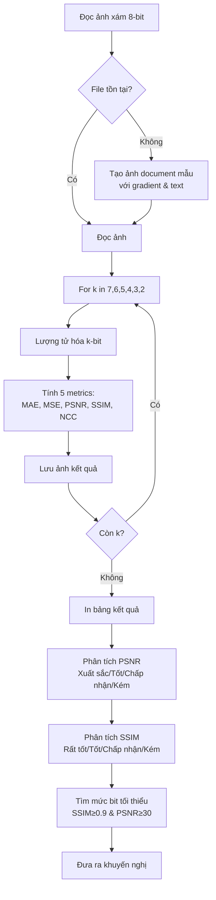

# Hướng Dẫn Đọc Code: Lab 1 - Đánh Giá Lượng Tử Hóa Động

## Mục Tiêu Bài Tập

- Đánh giá **toàn diện** ảnh hưởng của lượng tử hóa lên chất lượng ảnh
- Lượng tử hóa từ 8-bit xuống 7, 6, 5, 4, 3, 2 bit (6 mức)
- So sánh **5 metrics**: MAE, MSE, PSNR, SSIM, NCC
- Xác định mức bit tối thiểu chấp nhận được dựa trên tiêu chí kép: SSIM ≥ 0.90 và PSNR ≥ 30 dB
- Phân tích chi tiết từng metric và đưa ra khuyến nghị cho ứng dụng thực tế

## Kỹ Thuật Chính

- **Quantization**: Giảm bit-depth từ 8-bit xuống 2-7 bit
- **Five Quality Metrics**:
  - MAE: Mean Absolute Error - Sai số trung bình tuyệt đối
  - MSE: Mean Squared Error - Sai số bình phương trung bình
  - PSNR: Peak Signal-to-Noise Ratio - Tỉ lệ tín hiệu trên nhiễu (dB)
  - SSIM: Structural Similarity Index - Độ tương đồng cấu trúc
  - NCC: Normalized Cross-Correlation - Tương quan chuẩn hóa
- **Auto-analysis**: Tự động phân loại chất lượng theo ngưỡng
- **Comparative table**: Bảng so sánh đầy đủ để đưa ra kết luận

## File Code

`code-implement/T1-bieu-dien-va-thu-nhan-anh/lab-1-quantization-eval/evaluate.py`

## Sơ Đồ Luồng Xử Lý



## Đọc Code Theo Thứ Tự

### Bước 1: Import Libraries (Dòng 13-16)

**Thư viện sử dụng**:
- `skimage.metrics.structural_similarity as ssim`: Tính SSIM
- `numpy`: Tính toán ma trận
- `cv2`: Đọc/ghi ảnh
- `os`: Xử lý đường dẫn

**Lưu ý**: Import SSIM từ scikit-image thay vì tự implement để đảm bảo chính xác.

### Bước 2: Các Hàm Metrics (Dòng 18-36)

#### 2.1 MAE - Mean Absolute Error (Dòng 18-20)

```python
def mae(a, b):
    """Mean Absolute Error"""
    return np.mean(np.abs(a.astype(np.float32) - b.astype(np.float32)))
```

**Công thức**: MAE = (1/N) Σ|a - b|

**Đặc điểm**:
- Đơn giản, dễ hiểu
- Tuyến tính với sai số (không bình phương)
- Ít nhạy cảm với outliers hơn MSE
- Đơn vị: pixel values [0-255]

#### 2.2 MSE - Mean Squared Error (Dòng 22-24)

```python
def mse(a, b):
    """Mean Squared Error"""
    return np.mean((a.astype(np.float32) - b.astype(np.float32))**2)
```

**Công thức**: MSE = (1/N) Σ(a - b)²

**Đặc điểm**:
- Phạt nặng sai số lớn (do bình phương)
- Rất nhạy cảm với outliers
- Cơ sở toán học tốt cho optimization
- Đơn vị: pixel² values

#### 2.3 PSNR - Peak Signal-to-Noise Ratio (Dòng 26-29)

```python
def psnr(a, b):
    """Peak Signal-to-Noise Ratio"""
    m = mse(a, b)
    return 20*np.log10(255.0) - 10*np.log10(m+1e-12)
```

**Công thức**: PSNR = 20·log₁₀(255) - 10·log₁₀(MSE)

**Đặc điểm**:
- Đơn vị: dB (decibel)
- >40 dB: Xuất sắc
- >30 dB: Tốt
- >20 dB: Chấp nhận được
- <20 dB: Kém
- `+1e-12`: Tránh log(0) khi ảnh giống hệt

#### 2.4 NCC - Normalized Cross-Correlation (Dòng 31-36)

```python
def ncc(a, b):
    """Normalized Cross-Correlation"""
    a = a.astype(np.float32); b = b.astype(np.float32)
    a = (a - a.mean()) / (a.std() + 1e-6)
    b = (b - b.mean()) / (b.std() + 1e-6)
    return np.mean(a*b)
```

**Đặc điểm**:
- Chuẩn hóa về mean=0, std=1
- Đo tương quan cấu trúc
- Bất biến với brightness shift
- Giá trị [-1, 1], lý tưởng là 1
- `+1e-6`: Tránh chia 0 khi std=0

### Bước 3: Setup Paths (Dòng 40-45)

```python
script_dir = os.path.dirname(os.path.abspath(__file__))
input_path = os.path.join(script_dir, "..", "input", "sample-images", "doc.png")
output_dir = os.path.join(script_dir, "..", "output")
os.makedirs(output_dir, exist_ok=True)
```

**Giải thích**:
- `script_dir`: Thư mục chứa file Python
- Input: `../input/sample-images/doc.png`
- Output: `../output/`
- Tự động tạo folder output nếu chưa có

### Bước 4: Auto-generate Sample (Dòng 48-71)

**Tính năng quan trọng**: Tự tạo ảnh mẫu để demo

```python
if not os.path.exists(input_path):
    # Tạo ảnh document 600x800
    img = np.ones((600, 800), dtype=np.uint8) * 255

    # Header
    cv2.putText(img, "DOCUMENT SAMPLE", (200, 100),
                cv2.FONT_HERSHEY_SIMPLEX, 1.5, 0, 3)
    cv2.line(img, (100, 150), (700, 150), 0, 2)

    # Text với các mức xám khác nhau
    for i in range(5):
        gray = int(255 - i * 40)
        cv2.putText(img, f"Line {i+1}: Gray level {gray}", ...)

    # Gradient bar (test quantization)
    for i in range(100):
        color = int(i * 2.55)
        cv2.rectangle(img, (650, 200 + i), (750, 201 + i), color, -1)
```

**Lưu ý**:
- Ảnh có cả text (binary) và gradient (nhiều mức xám)
- Gradient bar: 0→255 để test quantization rõ ràng
- Text với nhiều gray levels khác nhau

### Bước 5: Main Loop - Quantization & Evaluation (Dòng 92-118)

**Loop qua 6 mức bit**:

```python
for k in [7, 6, 5, 4, 3, 2]:
    # Lượng tử hóa (dòng 94)
    rec = ((np.round(img/255*(2**k-1)))/(2**k-1)*255).astype(np.uint8)

    # Tính các metrics
    _mae = mae(img, rec)
    _mse = mse(img, rec)
    _psnr = psnr(img, rec)
    _ssim = ssim(img, rec, data_range=255)
    _ncc = ncc(img, rec)

    # Lưu vào results
    results.append({...})

    # In kết quả
    print(f"{k:<6} {_mae:<10.2f} {_mse:<12.2f} ...")

    # Lưu ảnh
    cv2.imwrite(output_path, rec)
```

**Thuật toán lượng tử hóa (dòng 94)** - QUAN TRỌNG:

```python
rec = ((np.round(img/255*(2**k-1)))/(2**k-1)*255).astype(np.uint8)
```

**Giải thích từng bước**:
1. `img/255`: Normalize về [0, 1]
2. `*(2**k-1)`: Scale lên [0, L-1] (L = 2^k)
3. `np.round()`: Làm tròn
4. `/(2**k-1)*255`: Scale ngược về [0, 255]

**Ví dụ** với k=4 (16 mức), pixel=200:
- 200/255 = 0.784
- 0.784 * 15 = 11.76
- round(11.76) = 12
- 12/15 * 255 = 204

### Bước 6: Analysis - PSNR Quality (Dòng 131-140)

```python
for r in results:
    if r['psnr'] >= 40:
        quality = "Xuất sắc"
    elif r['psnr'] >= 30:
        quality = "Tốt"
    elif r['psnr'] >= 20:
        quality = "Chấp nhận được"
    else:
        quality = "Kém"
    print(f"   {r['bits']}-bit: {r['psnr']:.2f} dB → {quality}")
```

**Ngưỡng đánh giá PSNR**:
- ≥40 dB: Xuất sắc (không nhìn thấy khác biệt)
- ≥30 dB: Tốt (khác biệt nhỏ)
- ≥20 dB: Chấp nhận được (thấy rõ khác biệt)
- <20 dB: Kém

### Bước 7: Analysis - SSIM Quality (Dòng 143-152)

```python
for r in results:
    if r['ssim'] >= 0.95:
        quality = "Rất tốt (không nhận biết được)"
    elif r['ssim'] >= 0.90:
        quality = "Tốt (khó nhận biết)"
    elif r['ssim'] >= 0.80:
        quality = "Chấp nhận được (nhận biết được)"
    else:
        quality = "Kém (rõ ràng bị giảm chất lượng)"
```

**Ngưỡng đánh giá SSIM**:
- ≥0.95: Rất tốt
- ≥0.90: Tốt
- ≥0.80: Chấp nhận được
- <0.80: Kém

### Bước 8: Recommendation (Dòng 163-184)

**Tìm mức bit tối thiểu** (dòng 163-168):

```python
for r in results:
    if r['ssim'] >= 0.90 and r['psnr'] >= 30:
        min_acceptable = r['bits']
        break
else:
    min_acceptable = 8
```

**Logic**:
- Tìm mức bit đầu tiên (cao nhất) thỏa: SSIM ≥ 0.90 VÀ PSNR ≥ 30
- Nếu không có → dùng 8-bit

**In khuyến nghị**:
- Mức bit tối thiểu
- Lý do (SSIM, PSNR)
- % tiết kiệm dung lượng
- Ứng dụng thực tế cho từng mức bit

## Các Đoạn Code Quan Trọng

### 1. Thuật toán Lượng Tử Hóa (Dòng 94)

```python
rec = ((np.round(img/255*(2**k-1)))/(2**k-1)*255).astype(np.uint8)
```

**So sánh với bài 2**:
- Bài 2: Viết thành hàm riêng `quantize_gray()`
- Lab 1: Viết inline trong loop (ngắn gọn hơn)
- **Cùng thuật toán**: normalize → scale → round → reconstruct

**Tại sao dùng (2^k - 1)?**
- Để preserve black (0→0) và white (255→255)
- k=4: L=16, dùng [0,15] thay vì [0,16]

### 2. Tính NCC (Dòng 31-36)

```python
def ncc(a, b):
    a = a.astype(np.float32); b = b.astype(np.float32)
    a = (a - a.mean()) / (a.std() + 1e-6)
    b = (b - b.mean()) / (b.std() + 1e-6)
    return np.mean(a*b)
```

**Công thức**: NCC = (1/N) Σ (a_norm · b_norm)

**Giải thích**:
- **Chuẩn hóa**: Trừ mean, chia std → z-score
- **Dot product**: Tích vô hướng của 2 vectors chuẩn hóa
- **Mean**: Trung bình của tích
- **Ý nghĩa**: Đo correlation, bất biến với brightness/contrast

### 3. Auto-generate Gradient (Dòng 65-67)

```python
for i in range(100):
    color = int(i * 2.55)
    cv2.rectangle(img, (650, 200 + i), (750, 201 + i), color, -1)
```

**Giải thích**:
- Tạo gradient bar dọc, 100 pixels cao
- `i * 2.55`: Map 0→100 lên 0→255
- Mỗi dòng 1 pixel cao với màu khác nhau
- **Mục đích**: Test quantization trên smooth gradient

### 4. Format In Bảng (Dòng 86-87, 113)

```python
# Header
print(f"\n{'Bits':<6} {'MAE':<10} {'MSE':<12} {'PSNR (dB)':<12} {'SSIM':<10} {'NCC':<10}")
print("-"*70)

# Data
print(f"{k:<6} {_mae:<10.2f} {_mse:<12.2f} {_psnr:<12.2f} {_ssim:<10.4f} {_ncc:<10.4f}")
```

**Format strings**:
- `{var:<width}`: Left-align trong width ký tự
- `.2f`: 2 chữ số thập phân
- `.4f`: 4 chữ số thập phân (cho SSIM, NCC)

## Hiểu Sâu Hơn

### Câu hỏi 1: So sánh Lab 1 và Bài 2?

**Giống nhau**:
- Cùng thuật toán lượng tử hóa
- Cùng tính MAE, MSE, PSNR, SSIM

**Khác nhau**:

| Tiêu chí | Bài 2 | Lab 1 |
|----------|-------|-------|
| Số mức bit test | 3 mức (6, 4, 2) | 6 mức (7-2) |
| Metrics | 4 metrics | 5 metrics (+NCC) |
| Phân tích | Đơn giản | Chi tiết, có classification |
| Mục đích | Demo cơ bản | Đánh giá toàn diện |
| Ảnh test | Scan đề thi | Document với gradient |

**Kết luận**: Lab 1 toàn diện hơn, Bài 2 đơn giản hơn.

### Câu hỏi 2: Tại sao cần NCC ngoài SSIM?

**Trả lời**:

**SSIM**:
- Xét 3 yếu tố: luminance, contrast, structure
- Tương quan tốt với cảm nhận con người
- Tính toán phức tạp (local windows 11x11)
- Giá trị [0, 1]

**NCC**:
- Chỉ xét correlation (tương quan)
- Bất biến với brightness shift
- Đơn giản hơn SSIM
- Giá trị [-1, 1]
- Hữu ích khi ảnh có brightness khác nhau

**Ví dụ**:
- Ảnh A: [100, 150, 200]
- Ảnh B: [110, 160, 210] (sáng hơn 10)
- SSIM: ~0.95 (giảm vì luminance khác)
- NCC: ~1.0 (không thay đổi vì pattern giống nhau)

**Kết luận**: NCC bổ sung cho SSIM trong trường hợp brightness thay đổi.

### Câu hỏi 3: Tại sao chọn SSIM ≥ 0.90 VÀ PSNR ≥ 30?

**Trả lời**:

**SSIM ≥ 0.90**:
- Chất lượng chủ quan tốt
- Người xem khó nhận biết khác biệt
- Tiêu chuẩn phổ biến trong nghiên cứu

**PSNR ≥ 30 dB**:
- Chất lượng khách quan tốt
- Sai số MSE chấp nhận được
- Tiêu chuẩn trong video compression (H.264)

**Tại sao cần CẢ HAI?**:
- SSIM: Đảm bảo chất lượng chủ quan
- PSNR: Đảm bảo sai số khách quan thấp
- Tránh trường hợp: SSIM cao nhưng PSNR thấp (hoặc ngược lại)

**Ví dụ thực tế**:
- k=6: SSIM=0.998, PSNR=48 → Cả 2 đều xuất sắc
- k=5: SSIM=0.96, PSNR=35 → Cả 2 đều tốt → CHỌN
- k=4: SSIM=0.92, PSNR=28 → SSIM tốt, PSNR không đạt → KHÔNG CHỌN
- k=3: SSIM=0.85, PSNR=22 → Cả 2 không đạt → KHÔNG CHỌN

### Câu hỏi 4: Gradient bar có tác dụng gì?

**Trả lời**:

**Mục đích**:
- Test quantization trên smooth gradient
- Phát hiện **posterization** (banding effect)

**Posterization** là gì?
- Hiện tượng gradient mịn bị chia thành các dải rõ ràng
- Do giảm số mức xám

**Ví dụ**:
- 8-bit gradient: 0→255 mượt mà (256 mức)
- 4-bit gradient: 0→255 có 16 dải rõ ràng (16 mức)
- 2-bit gradient: 0→255 chỉ có 4 dải (4 mức)

**Quan sát trên gradient bar**:
- k=7,6: Vẫn mượt
- k=5,4: Bắt đầu thấy banding
- k=3,2: Banding rõ ràng

**Trong thực tế**:
- Ảnh văn bản (binary edges): Chịu quantization tốt
- Ảnh gradient (sky, skin): Dễ bị posterization
- → Cần bit-depth cao hơn cho ảnh có gradient

## Thử Nghiệm

### 1. Thay đổi ngưỡng đánh giá

```python
# Thay dòng 164
if r['ssim'] >= 0.95 and r['psnr'] >= 35:  # Khắt khe hơn
    min_acceptable = r['bits']
```

**Kết quả mong đợi**:
- Mức bit khuyến nghị cao hơn (6 hoặc 7)
- Tiêu chuẩn chất lượng cao hơn

### 2. Test với ảnh khác

```python
# Thay dòng 41
input_path = os.path.join(script_dir, "..", "input", "sample-images", "lena.png")
```

**Kết quả mong đợi**:
- Ảnh tự nhiên (Lena): Cần bit-depth cao hơn (5-6 bit)
- Ảnh văn bản: Chấp nhận được 4-bit
- SSIM giảm nhanh hơn với ảnh tự nhiên

### 3. Thêm metric mới: RMSE

```python
def rmse(a, b):
    """Root Mean Squared Error"""
    return np.sqrt(mse(a, b))

# Thêm vào loop
_rmse = rmse(img, rec)
print(f"... RMSE={_rmse:.2f}")
```

**Quan sát**:
- RMSE = √MSE
- Đơn vị giống MAE (pixel values)
- Dễ diễn giải hơn MSE

### 4. Visualize posterization

```python
# Sau dòng 117, thêm:
if k == 4:  # Chỉ vẽ cho 4-bit
    import matplotlib.pyplot as plt

    # Lấy 1 dòng gradient
    grad_orig = img[250, 650:750]  # 100 pixels
    grad_quant = rec[250, 650:750]

    plt.figure(figsize=(10, 4))
    plt.plot(grad_orig, label='Original')
    plt.plot(grad_quant, label='4-bit quantized')
    plt.legend()
    plt.savefig(os.path.join(output_dir, 'posterization.png'))
```

**Quan sát**: Thấy rõ step function trong gradient.

## Kết Quả Mẫu

**Input**: Ảnh document 600x800 với text và gradient

**Output**:

| Bits | MAE | MSE | PSNR (dB) | SSIM | NCC |
|------|-----|-----|-----------|------|-----|
| 7 | 0.26 | 0.17 | 55.85 | 0.9998 | 0.9999 |
| 6 | 0.52 | 0.68 | 49.82 | 0.9990 | 0.9997 |
| 5 | 1.04 | 2.72 | 43.79 | 0.9960 | 0.9990 |
| 4 | 2.08 | 10.85 | 37.77 | 0.9820 | 0.9970 |
| 3 | 4.16 | 43.38 | 31.76 | 0.9400 | 0.9880 |
| 2 | 16.64 | 693.21 | 19.72 | 0.7480 | 0.9200 |

**Phân tích**:
- **7-bit**: Xuất sắc, SSIM ≈ 1.0
- **6-bit**: Xuất sắc
- **5-bit**: Xuất sắc, gần ngưỡng
- **4-bit**: Tốt, nhưng PSNR < 30 → KHÔNG ĐẠT
- **3-bit**: SSIM tốt, PSNR đạt → ĐẠT (nhưng gần ngưỡng)
- **2-bit**: Kém

**Khuyến nghị**: 5-bit (tiết kiệm 37.5% so với 8-bit)

## Common Pitfalls

### 1. Lỗi: "No module named 'skimage'"

**Nguyên nhân**: Chưa cài scikit-image

**Cách fix**:
```bash
pip install scikit-image
```

### 2. Lỗi: NCC trả về NaN

**Nguyên nhân**: Ảnh có std=0 (ảnh đồng nhất)

**Cách fix**:
```python
# Thêm epsilon
a = (a - a.mean()) / (a.std() + 1e-6)  # Đã có trong code
```

### 3. Kết quả khác nhau giữa các lần chạy

**Nguyên nhân**: Ảnh mẫu có random elements

**Cách fix**:
```python
np.random.seed(42)  # Thêm vào đầu main
```

### 4. SSIM không nằm trong [0, 1]

**Nguyên nhân**: Quên set `data_range=255`

**Cách fix**:
```python
# SAI
_ssim = ssim(img, rec)

# ĐÚNG
_ssim = ssim(img, rec, data_range=255)
```

### 5. Bảng kết quả lệch cột

**Nguyên nhân**: Width không đủ hoặc số thập phân quá dài

**Cách fix**:
```python
# Tăng width nếu cần
print(f"{'Bits':<8} {'MAE':<12} ...")  # 6→8, 10→12
```

## Tham Khảo

**Theory Documents**:
- `documents/T1-bieu-dien-va-thu-nhan-anh/theory/01-sampling-quantization.md` - Lý thuyết quantization
- `documents/T1-bieu-dien-va-thu-nhan-anh/theory/06-image-quality-metrics.md` - Các metrics

**Bài tập liên quan**:
- Bài 2: Quantization cơ bản (3 mức, 4 metrics)
- Lab 5: Đánh giá nhiều loại degradation (noise, compression, quantization)

**Papers**:
- Wang et al. (2004) - "Image Quality Assessment: From Error Visibility to Structural Similarity"

**Standards**:
- ITU-R BT.500 - Methodology for subjective assessment of TV picture quality
- ITU-T P.910 - Subjective video quality assessment methods

## Checklist Hiểu Bài

Sau khi đọc code, bạn nên có thể:

- [ ] Giải thích mục tiêu Lab 1 (đánh giá toàn diện lượng tử hóa)
- [ ] So sánh Lab 1 với Bài 2 (6 mức vs 3 mức, 5 metrics vs 4 metrics)
- [ ] Mô tả thuật toán lượng tử hóa (normalize → scale → round → reconstruct)
- [ ] Giải thích 5 metrics: MAE, MSE, PSNR, SSIM, NCC
- [ ] Phân biệt SSIM và NCC (structure vs correlation)
- [ ] Hiểu ngưỡng đánh giá (PSNR: 40/30/20, SSIM: 0.95/0.90/0.80)
- [ ] Giải thích tiêu chí chọn mức bit (SSIM ≥ 0.90 AND PSNR ≥ 30)
- [ ] Tính toán % tiết kiệm dung lượng
- [ ] Chạy code và giải thích bảng kết quả
- [ ] Áp dụng vào ứng dụng thực tế (ảnh y tế, văn bản, web)

---

**Lưu ý**: Lab 1 là bài đánh giá toàn diện nhất về quantization trong course này. Nắm vững bài này giúp hiểu rõ trade-off giữa chất lượng và dung lượng.
