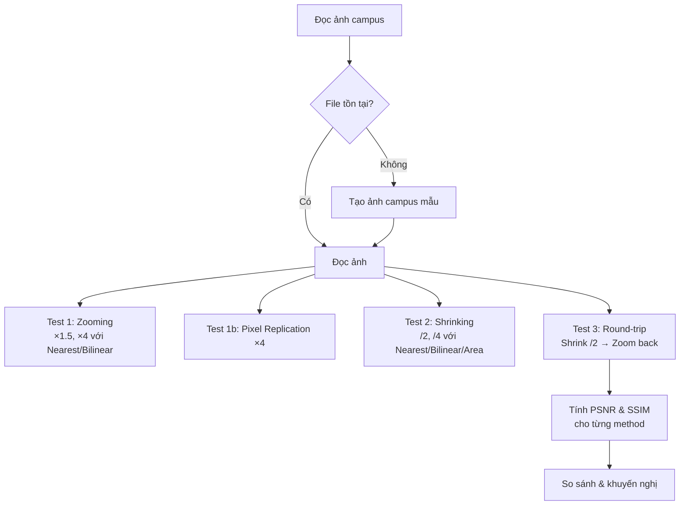

# Hướng Dẫn Đọc Code: Lab 2 - Zooming & Shrinking

## Mục Tiêu Bài Tập

- So sánh các phương pháp **interpolation** khi resize ảnh
- Test **zooming** (phóng to): Nearest, Bilinear, Pixel Replication
- Test **shrinking** (thu nhỏ): Nearest, Bilinear, Area
- Đánh giá chất lượng khi **shrink rồi zoom back** (round-trip)
- So sánh PSNR & SSIM của từng phương pháp
- Hiểu ưu/nhược điểm từng interpolation method

## Kỹ Thuật Chính

- **Interpolation Methods**:
  - INTER_NEAREST: Nearest neighbor (nhanh nhất, blocky)
  - INTER_LINEAR: Bilinear interpolation (cân bằng speed/quality)
  - INTER_CUBIC: Bicubic interpolation (chậm nhất, mịn nhất)
  - INTER_AREA: Resampling using pixel area relation (tốt cho shrinking)
- **Pixel Replication**: `np.repeat()` thay vì interpolation
- **Round-trip Test**: Shrink → Zoom back → So sánh với gốc

## File Code

`code-implement/T1-bieu-dien-va-thu-nhan-anh/lab-2-zooming-shrinking/resize.py`

## Sơ Đồ Luồng Xử Lý



## Đọc Code Theo Thứ Tự

### Bước 1: Zooming (Phóng To) - Dòng 68-103

**Test với 2 scale factors**: ×1.5 và ×4

```python
scales = [1.5, 4.0]
for scale in scales:
    # Nearest neighbor
    up_near = cv2.resize(img, None, fx=scale, fy=scale,
                        interpolation=cv2.INTER_NEAREST)

    # Bilinear
    up_bili = cv2.resize(img, None, fx=scale, fy=scale,
                        interpolation=cv2.INTER_LINEAR)
```

**cv2.resize() parameters**:
- `img`: Ảnh input
- `None`: Output size (để None nếu dùng fx/fy)
- `fx, fy`: Scale factors (1.5 = tăng 50%, 4 = tăng 300%)
- `interpolation`: Phương pháp nội suy

**Interpolation methods**:

**INTER_NEAREST** (Nearest Neighbor):
- Lấy pixel gần nhất
- Nhanh nhất
- Hiệu ứng "blocky" (gạch)
- Dùng khi: Cần tốc độ, hoặc ảnh pixel art

**INTER_LINEAR** (Bilinear):
- Nội suy tuyến tính từ 4 pixels gần nhất
- Cân bằng speed/quality
- Mịn hơn Nearest
- Dùng khi: Hầu hết trường hợp zooming

**Pixel Replication** (dòng 92-96):
```python
rep = np.repeat(np.repeat(img, 4, axis=0), 4, axis=1)
```
- `np.repeat(img, 4, axis=0)`: Lặp mỗi row 4 lần
- `np.repeat(..., 4, axis=1)`: Lặp mỗi column 4 lần
- Kết quả: Giống INTER_NEAREST nhưng đơn giản hơn

### Bước 2: Shrinking (Thu Nhỏ) - Dòng 105-136

**Test với 2 factors**: /2 và /4

```python
shrink_factors = [2, 4]
for factor in shrink_factors:
    fx = fy = 1.0/factor

    # Nearest
    small_near = cv2.resize(img, None, fx=fx, fy=fy,
                           interpolation=cv2.INTER_NEAREST)

    # Bilinear
    small_bili = cv2.resize(img, None, fx=fx, fy=fy,
                           interpolation=cv2.INTER_LINEAR)

    # Area (tốt nhất cho shrinking)
    small_area = cv2.resize(img, None, fx=fx, fy=fy,
                           interpolation=cv2.INTER_AREA)
```

**INTER_AREA**:
- Resampling using pixel area relation
- Tính trung bình các pixels trong vùng
- Tốt nhất cho shrinking (giảm aliasing)
- Dùng khi: Thu nhỏ ảnh

**Ví dụ INTER_AREA** với shrink /2:
```
Original (4x4):
[10 20 30 40]
[15 25 35 45]
[50 60 70 80]
[55 65 75 85]

→ Shrinked (2x2):
[(10+20+15+25)/4  (30+40+35+45)/4]  = [17.5  37.5]
[(50+60+55+65)/4  (70+80+75+85)/4]  = [57.5  77.5]
```

### Bước 3: Round-trip Test - Dòng 138-168

**Mục đích**: Đánh giá loss of information khi shrink → zoom back

```python
methods = [
    ('NEAREST', cv2.INTER_NEAREST),
    ('LINEAR', cv2.INTER_LINEAR),
    ('AREA', cv2.INTER_AREA),
    ('CUBIC', cv2.INTER_CUBIC)
]

for name, method in methods:
    # Thu nhỏ /2
    small = cv2.resize(img, None, fx=0.5, fy=0.5, interpolation=method)

    # Phóng to về kích thước ban đầu
    back = cv2.resize(small, (img.shape[1], img.shape[0]), interpolation=method)

    # Tính metrics
    psnr_val = cv2.PSNR(img, back)
    ssim_val = ssim(img, back, data_range=255)

    print(f"{name:<15} {psnr_val:<12.2f} {ssim_val:<10.4f}")
```

**Lưu ý**:
- `cv2.resize(small, (width, height), ...)`: Chỉ định output size chính xác
- `(img.shape[1], img.shape[0])`: (width, height) - chú ý đảo ngược!
- **INTER_CUBIC**: Thêm phương pháp mới, bicubic interpolation (16 pixels)

**Kết quả mong đợi**:
- CUBIC > LINEAR > AREA > NEAREST
- CUBIC có PSNR & SSIM cao nhất (ít loss nhất)

## Các Đoạn Code Quan Trọng

### 1. cv2.resize() với Scale Factors (Dòng 78-79)

```python
up_near = cv2.resize(img, None, fx=scale, fy=scale,
                    interpolation=cv2.INTER_NEAREST)
```

**Hai cách dùng cv2.resize()**:

**Cách 1: Scale factors** (fx, fy):
```python
cv2.resize(img, None, fx=1.5, fy=1.5, interpolation=...)
```
- Output size = input size × (fx, fy)
- Dễ dùng khi muốn scale theo tỷ lệ

**Cách 2: Absolute size** (width, height):
```python
cv2.resize(img, (640, 480), interpolation=...)
```
- Output size = (640, 480)
- Dễ dùng khi biết kích thước chính xác

### 2. Pixel Replication (Dòng 93)

```python
rep = np.repeat(np.repeat(img, 4, axis=0), 4, axis=1)
```

**Giải thích**:
- `np.repeat(img, 4, axis=0)`: Lặp mỗi row 4 lần
  ```
  [1, 2]      [1, 2]
  [3, 4]  →   [1, 2]
              [1, 2]
              [1, 2]
              [3, 4]
              [3, 4]
              [3, 4]
              [3, 4]
  ```
- `np.repeat(..., 4, axis=1)`: Lặp mỗi column 4 lần
  ```
  [1, 2]      [1, 1, 1, 1, 2, 2, 2, 2]
  [1, 2]  →   [1, 1, 1, 1, 2, 2, 2, 2]
  ...         ...
  ```

**Kết quả**: Giống INTER_NEAREST nhưng đơn giản hơn.

### 3. INTER_AREA for Shrinking (Dòng 131-133)

```python
small_area = cv2.resize(img, None, fx=fx, fy=fy,
                       interpolation=cv2.INTER_AREA)
```

**Tại sao INTER_AREA tốt cho shrinking?**
- Tính trung bình pixels trong vùng
- Giảm aliasing (moiré patterns)
- Preserve brightness (không làm sáng/tối)

**So sánh**:
- NEAREST: Chọn 1 pixel → mất thông tin
- BILINEAR: Nội suy → có thể ringing
- AREA: Trung bình → smooth nhất

### 4. cv2.PSNR() (Dòng 160)

```python
psnr_val = cv2.PSNR(img, back)
```

**OpenCV built-in PSNR**:
- Nhanh hơn tự tính
- Tương đương: `20*log10(255) - 10*log10(MSE)`

## Hiểu Sâu Hơn

### Câu hỏi 1: Interpolation methods hoạt động như thế nào?

**Trả lời**:

**Nearest Neighbor**:
- Lấy pixel gần nhất
- Công thức: `out[i, j] = in[round(i/scale), round(j/scale)]`

**Bilinear**:
- Nội suy từ 4 pixels (2×2 grid)
- Công thức:
  ```
  P = (1-dx)*(1-dy)*P00 + dx*(1-dy)*P10 +
      (1-dx)*dy*P01     + dx*dy*P11
  ```
  Trong đó dx, dy là khoảng cách phân số

**Bicubic**:
- Nội suy từ 16 pixels (4×4 grid)
- Sử dụng cubic polynomials
- Mịn nhất nhưng chậm nhất

**Area**:
- Dùng khi shrinking
- Tính trung bình pixels trong vùng
- Công thức: `out[i, j] = mean(in[region])`

### Câu hỏi 2: Khi nào dùng method nào?

**Trả lời**:

| Trường hợp | Method | Lý do |
|------------|--------|-------|
| Zooming general | INTER_LINEAR | Cân bằng speed/quality |
| Zooming high quality | INTER_CUBIC | Mịn nhất |
| Zooming real-time | INTER_NEAREST | Nhanh nhất |
| Shrinking | INTER_AREA | Giảm aliasing |
| Pixel art, sprites | INTER_NEAREST | Preserve sharp edges |
| Medical imaging | INTER_LINEAR hoặc CUBIC | Cần accuracy |

### Câu hỏi 3: Tại sao round-trip không trả về ảnh gốc?

**Trả lời**:

**Vấn đề**:
- Shrink: Mất thông tin (nhiều pixels → 1 pixel)
- Zoom back: Không thể phục hồi thông tin đã mất

**Ví dụ**:
```
Original: [10, 20, 30, 40]
Shrink /2 (AREA): [15, 35]  # (10+20)/2=15, (30+40)/2=35
Zoom ×2 (LINEAR): [15, 25, 35, 35]  # Nội suy
```
- Không trở về [10, 20, 30, 40]!
- Mất thông tin vĩnh viễn

**Information loss**:
- NEAREST: Mất nhiều nhất (chọn 1 bỏ 3)
- AREA: Mất ít hơn (trung bình)
- CUBIC: Phục hồi tốt nhất (nội suy smooth)

### Câu hỏi 4: Aliasing là gì? Tại sao INTER_AREA giảm được?

**Trả lời**:

**Aliasing**:
- Hiện tượng moiré patterns khi shrink
- Do undersampling (sampling rate < Nyquist frequency)

**Ví dụ**:
- Ảnh có pattern kẻ sọc mịn (1 pixel)
- Shrink /2: Chỉ lấy 1/2 số sọc
- Kết quả: Pattern mới xuất hiện (moiré)

**INTER_AREA giải quyết**:
- Tính trung bình → low-pass filter
- Làm mờ trước khi sample → giảm high frequencies
- Kết quả: Ít aliasing hơn

## Thử Nghiệm

### 1. Test với ảnh có pattern

```python
# Tạo ảnh checkerboard
checker = np.zeros((200, 200), dtype=np.uint8)
checker[::2, ::2] = 255  # White squares
checker[1::2, 1::2] = 255

# Shrink với các methods
near = cv2.resize(checker, (50, 50), interpolation=cv2.INTER_NEAREST)
area = cv2.resize(checker, (50, 50), interpolation=cv2.INTER_AREA)

# Quan sát aliasing
```

**Quan sát**: AREA mịn hơn, ít aliasing hơn.

### 2. Benchmark tốc độ

```python
import time

methods = [cv2.INTER_NEAREST, cv2.INTER_LINEAR, cv2.INTER_CUBIC, cv2.INTER_AREA]
for method in methods:
    start = time.time()
    for _ in range(100):
        cv2.resize(img, None, fx=2, fy=2, interpolation=method)
    elapsed = time.time() - start
    print(f"{method}: {elapsed:.3f}s")
```

**Kết quả**: NEAREST < LINEAR < AREA < CUBIC

### 3. Visualize interpolation

```python
# Zoom 1 pixel lên 10×10 để thấy rõ interpolation
pixel = np.array([[100, 200]], dtype=np.uint8)

near = cv2.resize(pixel, (10, 10), interpolation=cv2.INTER_NEAREST)
bili = cv2.resize(pixel, (10, 10), interpolation=cv2.INTER_LINEAR)
cubic = cv2.resize(pixel, (10, 10), interpolation=cv2.INTER_CUBIC)

print("NEAREST:", near[5, :])  # [100, 100, ..., 200, 200]
print("LINEAR:", bili[5, :])   # [100, 110, 120, ..., 190, 200]
print("CUBIC:", cubic[5, :])   # Smooth curve
```

## Kết Quả Mẫu

**Input**: Campus 480x640

**Zooming ×4**:
- Nearest: Blocky, sharp edges
- Bilinear: Mịn hơn
- Replication: Giống Nearest

**Shrinking /4**:
- Nearest: 120x160, có aliasing
- Bilinear: 120x160, mịn
- Area: 120x160, mịn nhất, ít aliasing

**Round-trip (/2 → ×2)**:
- NEAREST: PSNR=28 dB, SSIM=0.85
- LINEAR: PSNR=32 dB, SSIM=0.92
- AREA: PSNR=30 dB, SSIM=0.88
- CUBIC: PSNR=34 dB, SSIM=0.95 (tốt nhất)

## Common Pitfalls

### 1. Lỗi: Width/Height đảo ngược

**Nguyên nhân**: cv2.resize dùng (width, height), shape là (height, width)

**Cách fix**:
```python
# SAI
cv2.resize(img, img.shape[:2], ...)  # (height, width)

# ĐÚNG
cv2.resize(img, (img.shape[1], img.shape[0]), ...)  # (width, height)
```

### 2. Lỗi: Dùng sai method cho shrinking

**Cách tốt**:
```python
# Zooming: LINEAR hoặc CUBIC
up = cv2.resize(img, None, fx=2, fy=2, interpolation=cv2.INTER_LINEAR)

# Shrinking: AREA
down = cv2.resize(img, None, fx=0.5, fy=0.5, interpolation=cv2.INTER_AREA)
```

### 3. Lỗi: fx/fy vs (width, height)

Không thể dùng cả hai cùng lúc:
```python
# SAI
cv2.resize(img, (640, 480), fx=2, fy=2, ...)  # Conflict!

# ĐÚNG: Chọn 1 trong 2
cv2.resize(img, None, fx=2, fy=2, ...)        # Scale factors
cv2.resize(img, (640, 480), ...)              # Absolute size
```

## Tham Khảo

**Theory**:
- `documents/T1-bieu-dien-va-thu-nhan-anh/theory/07-interpolation.md`

**OpenCV Docs**:
- [cv2.resize()](https://docs.opencv.org/4.x/da/d54/group__imgproc__transform.html#ga47a974309e9102f5f08231edc7e7529d)

**Papers**:
- Keys (1981) - "Cubic Convolution Interpolation for Digital Image Processing"

## Checklist Hiểu Bài

- [ ] Giải thích 4 interpolation methods
- [ ] So sánh Nearest vs Bilinear vs Cubic vs Area
- [ ] Hiểu tại sao AREA tốt cho shrinking
- [ ] Giải thích aliasing và cách AREA giảm
- [ ] Tính PSNR & SSIM cho round-trip test
- [ ] Chọn method phù hợp cho từng trường hợp
- [ ] Hiểu tại sao round-trip mất thông tin
- [ ] Benchmark tốc độ các methods

---

**Lưu ý**: Lab này quan trọng cho mọi ứng dụng resize ảnh (thumbnails, display, preprocessing).
