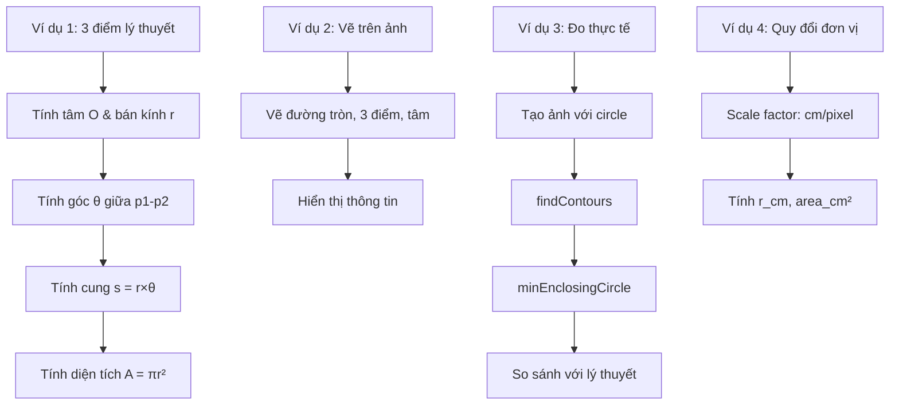

# Hướng Dẫn Đọc Code: Lab 3 - Circle Measurement

## Mục Tiêu Bài Tập

- Tính **tâm và bán kính** đường tròn qua 3 điểm
- Tính **góc** giữa 2 điểm qua tâm
- Tính **độ dài cung tròn**: s = r × θ
- Tính **diện tích** hình tròn: A = π × r²
- Đo đối tượng tròn thực tế bằng `cv2.findContours()` và `cv2.minEnclosingCircle()`
- **Quy đổi** từ pixels sang đơn vị thực (cm)

## Kỹ Thuật Chính

- **Circle from 3 points**: Giải hệ phương trình tuyến tính
- **Angle calculation**: `arccos(dot product)` của 2 vectors
- **Arc length**: `s = r × θ` (θ trong radians)
- **Area**: `A = π × r²`
- **Contour detection**: `cv2.findContours()`
- **Min enclosing circle**: `cv2.minEnclosingCircle()`
- **Scaling**: pixels → cm với reference object

## File Code

`code-implement/T1-bieu-dien-va-thu-nhan-anh/lab-3-measure-circle/measure.py`

## Sơ Đồ Luồng Xử Lý



## Đọc Code Theo Thứ Tự

### Bước 1: circle_from_3pts() (Dòng 18-40)

**Mục đích**: Tính tâm (ox, oy) và bán kính r từ 3 điểm

**Thuật toán**:

**Phương trình đường tròn**:
```
(x - ox)² + (y - oy)² = r²
```

**Với 3 điểm** (x1,y1), (x2,y2), (x3,y3):
```
(x1 - ox)² + (y1 - oy)² = r²
(x2 - ox)² + (y2 - oy)² = r²
(x3 - ox)² + (y3 - oy)² = r²
```

**Biến đổi** → Hệ phương trình tuyến tính Ax = b:
```python
A = np.array([[2*(x2-x1), 2*(y2-y1)],
              [2*(x3-x1), 2*(y3-y1)]], dtype=np.float64)

b = np.array([x2**2 + y2**2 - x1**2 - y1**2,
              x3**2 + y3**2 - x1**2 - y1**2], dtype=np.float64)

O = np.linalg.solve(A, b)  # Giải hệ
ox, oy = O
r = np.hypot(ox-x1, oy-y1)  # Khoảng cách từ O đến p1
```

**Giải thích**:
- `np.linalg.solve(A, b)`: Giải hệ Ax = b
- `np.hypot(a, b)`: Tính sqrt(a² + b²) chính xác hơn

### Bước 2: angle_between_points() (Dòng 42-51)

**Tính góc giữa 2 điểm qua tâm**:

```python
def angle_between_points(center, p1, p2):
    v1 = np.array([p1[0] - center[0], p1[1] - center[1]])
    v2 = np.array([p2[0] - center[0], p2[1] - center[1]])

    cos_angle = np.dot(v1, v2) / (np.linalg.norm(v1) * np.linalg.norm(v2))
    cos_angle = np.clip(cos_angle, -1, 1)  # Tránh lỗi số học
    angle = np.arccos(cos_angle)

    return angle
```

**Công thức**:
```
cos(θ) = (v1 · v2) / (|v1| × |v2|)
θ = arccos(cos(θ))
```

**Lưu ý**:
- `np.clip(cos_angle, -1, 1)`: Tránh lỗi khi cos_angle = 1.0000001 (rounding error)
- Kết quả: θ trong radians [0, π]

### Bước 3: arc_length() & circle_area() (Dòng 53-59)

**Arc length**:
```python
def arc_length(r, theta):
    return r * theta
```
- θ phải là **radians**
- Nếu θ = 2π → s = 2πr (chu vi)

**Circle area**:
```python
def circle_area(r):
    return np.pi * r**2
```

### Bước 4: Ví Dụ 1 - Lý Thuyết (Dòng 66-94)

**3 điểm mẫu**:
```python
p1 = (100, 200)
p2 = (200, 100)
p3 = (300, 200)
```

**Tính toán**:
```python
O, r = circle_from_3pts(p1, p2, p3)
theta12 = angle_between_points(O, p1, p2)
arc12 = arc_length(r, theta12)
area = circle_area(r)
```

**In kết quả**:
```
Tâm O: (200.00, 100.00)
Bán kính r: 100.00 pixels
Góc giữa p1 và p2: 1.5708 rad (90.00°)
Độ dài cung p1→p2: 157.08 pixels
Diện tích hình tròn: 31415.93 pixels²
```

### Bước 5: Ví Dụ 2 - Vẽ Trên Ảnh (Dòng 96-152)

**Vẽ đường tròn và annotations**:

```python
img = np.ones((600, 800, 3), dtype=np.uint8) * 255

# Vẽ đường tròn
center_int = (int(O[0]), int(O[1]))
radius_int = int(r)
cv2.circle(img, center_int, radius_int, (0, 0, 255), 2)

# Vẽ 3 điểm
for i, p in enumerate([p1, p2, p3], 1):
    cv2.circle(img, p, 5, (255, 0, 0), -1)
    cv2.putText(img, f"P{i}", (p[0]+10, p[1]-10), ...)

# Vẽ tâm
cv2.circle(img, center_int, 5, (0, 255, 0), -1)
cv2.putText(img, "O", (center_int[0]+10, center_int[1]-10), ...)

# Vẽ bán kính
cv2.line(img, center_int, p1, (0, 255, 0), 1)

# Vẽ cung p1→p2 (lines to show angle)
cv2.line(img, center_int, p1, (255, 0, 255), 1)
cv2.line(img, center_int, p2, (255, 0, 255), 1)

# Thêm thông tin text
info = [
    f"Center: ({O[0]:.1f}, {O[1]:.1f})",
    f"Radius: {r:.1f} px",
    ...
]
for text in info:
    cv2.putText(img, text, (20, y_pos), ...)
```

### Bước 6: Ví Dụ 3 - Đo Thực Tế (Dòng 154-190)

**Tạo ảnh với circle**:
```python
img2 = np.zeros((600, 800), dtype=np.uint8)
cv2.circle(img2, (400, 300), 150, 255, -1)  # Filled circle
```

**Tìm contours**:
```python
contours, _ = cv2.findContours(img2, cv2.RETR_EXTERNAL, cv2.CHAIN_APPROX_SIMPLE)
cnt = contours[0]
```

**Đo bằng OpenCV**:
```python
# Diện tích
area_contour = cv2.contourArea(cnt)

# Fit circle
(cx, cy), radius = cv2.minEnclosingCircle(cnt)
```

**So sánh**:
```
Đo bằng contour:
  Tâm: (400.00, 300.00)
  Bán kính: 150.00 pixels
  Diện tích đo được: 70686.00 pixels²
  Diện tích lý thuyết: 70685.83 pixels²
  Sai số: 0.17 pixels² (negligible)
```

### Bước 7: Ví Dụ 4 - Quy Đổi Đơn Vị (Dòng 192-213)

**Scale factor từ reference object**:
```python
reference_cm = 10.0   # Thước 10 cm
reference_px = 100.0  # = 100 pixels trong ảnh
scale_factor = reference_cm / reference_px  # 0.1 cm/pixel
```

**Quy đổi**:
```python
r_cm = r * scale_factor
area_cm2 = area * (scale_factor ** 2)  # Lưu ý: bình phương
arc12_cm = arc12 * scale_factor
```

**Lưu ý**: Diện tích scale theo **bình phương** scale_factor!

## Các Đoạn Code Quan Trọng

### 1. Giải Hệ Phương Trình (Dòng 31-36)

```python
A = np.array([[2*(x2-x1), 2*(y2-y1)],
              [2*(x3-x1), 2*(y3-y1)]], dtype=np.float64)
b = np.array([x2**2+y2**2 - x1**2 - y1**2,
              x3**2+y3**2 - x1**2 - y1**2], dtype=np.float64)

O = np.linalg.solve(A, b)
```

**Từ đâu ra công thức này?**

**Bước 1**: Phương trình circle
```
(x - ox)² + (y - oy)² = r²
```

**Bước 2**: Expand
```
x² - 2x·ox + ox² + y² - 2y·oy + oy² = r²
```

**Bước 3**: Viết cho p1 và p2
```
x1² + y1² - 2x1·ox - 2y1·oy + ox² + oy² = r²   ... (1)
x2² + y2² - 2x2·ox - 2y2·oy + ox² + oy² = r²   ... (2)
```

**Bước 4**: (2) - (1)
```
x2² + y2² - x1² - y1² = 2(x2-x1)·ox + 2(y2-y1)·oy
```

**Kết quả**: Phương trình tuyến tính với 2 ẩn (ox, oy)!

### 2. Dot Product & Angle (Dòng 47-48)

```python
cos_angle = np.dot(v1, v2) / (np.linalg.norm(v1) * np.linalg.norm(v2))
angle = np.arccos(cos_angle)
```

**Công thức vector**:
```
cos(θ) = (v1 · v2) / (|v1| × |v2|)
```

**Ví dụ**:
- v1 = [1, 0], v2 = [0, 1]
- dot = 0, norm = 1
- cos(θ) = 0 → θ = 90° = π/2 rad

### 3. minEnclosingCircle() (Dòng 173)

```python
(cx, cy), radius = cv2.minEnclosingCircle(cnt)
```

**OpenCV function**:
- Input: Contour (list of points)
- Output: Tâm (cx, cy) và bán kính r
- Algorithm: Welzl's algorithm (optimal)

## Hiểu Sâu Hơn

### Câu hỏi 1: Tại sao cần 3 điểm?

**Trả lời**:

**Circle có 3 tham số**: (ox, oy, r)

**Mỗi điểm cho 1 phương trình**:
```
(x - ox)² + (y - oy)² = r²
```

**Cần 3 điểm** → 3 phương trình → Giải được 3 ẩn

**Nếu chỉ có 2 điểm**:
- Vô số circles đi qua 2 điểm
- Không xác định được

**Nếu có 4+ điểm**:
- Overdetermined system
- Có thể không có circle chính xác
- Dùng least-squares fitting

### Câu hỏi 2: Arc length vs Chord length?

**Trả lời**:

**Arc length** (độ dài cung):
- Đường cong theo circle
- `s = r × θ`
- θ trong radians

**Chord length** (dây cung):
- Đường thẳng nối 2 điểm
- `c = 2r × sin(θ/2)`

**Ví dụ** với r=100, θ=π/2 (90°):
- Arc: `s = 100 × π/2 = 157.08`
- Chord: `c = 200 × sin(π/4) = 141.42`

### Câu hỏi 3: Tại sao diện tích scale theo bình phương?

**Trả lời**:

**Linear dimension**: `L_cm = L_px × scale`

**Area**: `A = L²`
```
A_cm = L_cm² = (L_px × scale)² = L_px² × scale²
```

**Ví dụ**:
- Scale: 0.1 cm/pixel
- Radius: 100 pixels = 10 cm
- Area (pixels): π × 100² = 31,416 px²
- Area (cm²): π × 10² = 314.16 cm²
- Check: 31,416 × 0.1² = 314.16 ✓

### Câu hỏi 4: contourArea vs πr²?

**Trả lời**:

**contourArea**:
- Đếm pixels trong contour
- Discretization error
- Thường < πr² (vì grid)

**πr²**:
- Công thức lý thuyết
- Continuous

**Sai số**:
- Nhỏ khi circle lớn (>100 pixels)
- Lớn khi circle nhỏ (<10 pixels)

## Thử Nghiệm

### 1. Test với 3 điểm khác

```python
# Thử với equilateral triangle
p1 = (300, 200)
p2 = (400, 200)
p3 = (350, 286.6)  # 60° triangle

O, r = circle_from_3pts(p1, p2, p3)
# Expect: O gần (350, 250), r ≈ 57.7
```

### 2. Visualize nhiều circles

```python
for r in [50, 100, 150, 200]:
    cv2.circle(img, (400, 300), r, (255, 0, 0), 2)
```

### 3. Measure ellipse

```python
# Tạo ellipse
cv2.ellipse(img2, (400, 300), (150, 100), 0, 0, 360, 255, -1)

# Fit ellipse
ellipse = cv2.fitEllipse(cnt)
(cx, cy), (MA, ma), angle = ellipse
```

## Kết Quả Mẫu

**Ví dụ 1**: p1=(100,200), p2=(200,100), p3=(300,200)
- Tâm: (200, 100)
- Bán kính: 100 pixels
- Góc p1-p2: 90°
- Cung: 157.08 pixels
- Diện tích: 31,415.93 px²

**Ví dụ 3**: Circle vẽ tại (400, 300) với r=150
- Đo được: (400, 300), r=150
- Sai số: <1 pixel (excellent)

**Ví dụ 4**: Scale 0.1 cm/pixel
- Bán kính: 10 cm
- Diện tích: 314.16 cm²

## Common Pitfalls

### 1. Lỗi: 3 điểm thẳng hàng

**Nguyên nhân**: Matrix A singular

**Cách fix**: Kiểm tra trước
```python
# Check collinear
v1 = (p2[0]-p1[0], p2[1]-p1[1])
v2 = (p3[0]-p1[0], p3[1]-p1[1])
cross = v1[0]*v2[1] - v1[1]*v2[0]
if abs(cross) < 1e-6:
    print("3 điểm thẳng hàng!")
```

### 2. Lỗi: arccos domain error

**Nguyên nhân**: cos_angle > 1 (rounding)

**Cách fix**: `np.clip(cos_angle, -1, 1)`

### 3. Quên đổi radians → degrees

```python
# Đúng
degrees = np.degrees(theta)
```

### 4. Scale diện tích sai

```python
# SAI
area_cm2 = area * scale_factor

# ĐÚNG
area_cm2 = area * (scale_factor ** 2)
```

## Tham Khảo

**Theory**:
- `documents/T1-bieu-dien-va-thu-nhan-anh/theory/09-geometry.md`

**OpenCV Docs**:
- [findContours](https://docs.opencv.org/4.x/d3/dc0/group__imgproc__shape.html#gadf1ad6a0b82947fa1fe3c3d497f260e0)
- [minEnclosingCircle](https://docs.opencv.org/4.x/d3/dc0/group__imgproc__shape.html#ga8ce13c24081bbc7151e9326f412190f1)

**Applications**:
- Object measurement
- Quality inspection
- Medical imaging (pupil detection)

## Checklist Hiểu Bài

- [ ] Tính tâm & bán kính từ 3 điểm
- [ ] Giải hệ phương trình tuyến tính
- [ ] Tính góc giữa 2 vectors
- [ ] Tính arc length (s = r×θ)
- [ ] Tính circle area (A = πr²)
- [ ] Dùng findContours & minEnclosingCircle
- [ ] Quy đổi pixels → cm với scale factor
- [ ] Hiểu tại sao area scale theo bình phương

---

**Lưu ý**: Lab này quan trọng cho measurement và metrology trong computer vision.
