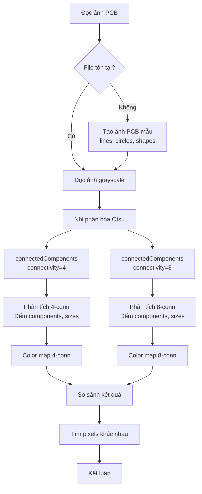

# Hướng Dẫn Đọc Code: Lab 4 - Connected Components Labeling

## Mục Tiêu Bài Tập

- Hiểu khái niệm **connected components** (thành phần liên thông)
- So sánh **4-connectivity** vs **8-connectivity** trong labeling
- Sử dụng `cv2.connectedComponents()` để gán nhãn
- Phân tích **số lượng components** và **kích thước** từng component
- Visualize bằng **color map** (false color)
- Ứng dụng: Phân tích mạch in (PCB), phát hiện đối tượng

## Kỹ Thuật Chính

- **Binary thresholding**: Otsu's method
- **Connected Components Labeling**: `cv2.connectedComponents()`
- **Connectivity**: 4 vs 8
- **Color mapping**: `cv2.applyColorMap()` với COLORMAP_JET
- **Component analysis**: Đếm số component, kích thước
- **Difference analysis**: So sánh kết quả 4-conn vs 8-conn

## File Code

`code-implement/T1-bieu-dien-va-thu-nhan-anh/lab-4-connected-components/labeling.py`

## Sơ Đồ Luồng Xử Lý



## Đọc Code Theo Thứ Tự

### Bước 1: Auto-generate PCB Sample (Dòng 27-57)

**Tạo ảnh mạch in mẫu**:

```python
img = np.ones((400, 600), dtype=np.uint8) * 255  # Nền trắng

# Vẽ các đường mạch
cv2.line(img, (50, 50), (250, 50), 0, 3)
cv2.line(img, (100, 50), (100, 150), 0, 3)
cv2.line(img, (200, 50), (200, 150), 0, 3)

# Vẽ các điểm nối (pads)
for x in [50, 100, 150, 200, 250]:
    cv2.circle(img, (x, 50), 8, 0, -1)

# Vẽ đường chéo (test connectivity)
for i in range(20):
    cv2.circle(img, (350 + i*5, 100 + i*5), 2, 0, -1)

# Vẽ các hình nhỏ rời rạc
cv2.rectangle(img, (400, 200), (450, 250), 0, -1)
cv2.circle(img, (500, 225), 25, 0, -1)

# Vẽ text
cv2.putText(img, "PCB", (250, 350), cv2.FONT_HERSHEY_SIMPLEX, 2, 0, 3)
```

**Đặc điểm**:
- Có lines (liên thông)
- Có diagonal pattern (test 4 vs 8)
- Có shapes rời rạc (test component detection)

### Bước 2: Binary Thresholding - Otsu (Dòng 71-77)

```python
_, bw = cv2.threshold(img, 0, 255, cv2.THRESH_BINARY+cv2.THRESH_OTSU)
```

**Otsu's method**:
- Tự động tìm threshold tối ưu
- Maximize inter-class variance
- Không cần chọn threshold thủ công

**Output**: Binary image (0 hoặc 255)

**Đếm pixels** (dòng 80-83):
```python
white_pixels = np.sum(bw == 255)
black_pixels = np.sum(bw == 0)
print(f"Pixel trắng: {white_pixels} ({white_pixels/bw.size*100:.1f}%)")
print(f"Pixel đen: {black_pixels} ({black_pixels/bw.size*100:.1f}%)")
```

### Bước 3: Connected Components Labeling (Dòng 91-131)

**Loop qua 2 connectivity**:

```python
for conn in [4, 8]:
    # Gán nhãn
    num, labels = cv2.connectedComponents(bw, connectivity=conn)

    print(f"Số thành phần liên thông: {num} (bao gồm background)")
    print(f"Số đối tượng: {num - 1}")
```

**cv2.connectedComponents()**:
- **Input**: Binary image (0/255)
- **connectivity**: 4 hoặc 8
- **Output**:
  - `num`: Số components (including background)
  - `labels`: Label map (0=background, 1,2,3,...=objects)

**Đếm kích thước components** (dòng 100-109):
```python
unique, counts = np.unique(labels, return_counts=True)
print(f"Kích thước các component:")
for label_id, count in zip(unique[:10], counts[:10]):
    if label_id == 0:
        print(f"  Label {label_id} (background): {count} pixels")
    else:
        print(f"  Label {label_id}: {count} pixels")
```

**Color mapping** (dòng 112-116):
```python
lab_norm = (labels / (labels.max() + 1e-6) * 255).astype(np.uint8)
color = cv2.applyColorMap(lab_norm, cv2.COLORMAP_JET)

# Làm cho background thành trắng
color[labels == 0] = [255, 255, 255]
```

**Giải thích**:
- `labels.max()`: Số label lớn nhất
- Normalize về [0, 255]
- `cv2.applyColorMap()`: Áp dụng colormap JET (red→yellow→green→blue)
- Background (label 0) → trắng

### Bước 4: So Sánh 4-conn vs 8-conn (Dòng 134-184)

**Đếm số components** (dòng 138-154):
```python
num_4 = results[4]['num_components']
num_8 = results[8]['num_components']

print(f"4-connectivity: {num_4} components")
print(f"8-connectivity: {num_8} components")
print(f"Chênh lệch: {abs(num_4 - num_8)} components")

if num_4 > num_8:
    print(f"\n4-connectivity có NHIỀU HƠN {num_4 - num_8} components")
    print("Lý do: Các pixel chéo không được coi là liên thông")
elif num_8 > num_4:
    print(f"\n8-connectivity có NHIỀU HƠN {num_8 - num_4} components")
    print("Lưu ý: Trường hợp này hiếm gặp")
else:
    print("\nSố components BẰNG NHAU")
    print("Lý do: Không có đường chéo ảnh hưởng đến kết quả")
```

**Tìm pixels khác nhau** (dòng 157-172):
```python
labels_4 = results[4]['labels']
labels_8 = results[8]['labels']

diff = (labels_4 != labels_8)
num_diff_pixels = np.sum(diff)

print(f"Số pixel có label khác nhau: {num_diff_pixels} ({num_diff_pixels/diff.size*100:.2f}%)")

# Vẽ ảnh khác biệt
diff_img = np.zeros_like(img)
diff_img[diff] = 255

diff_path = os.path.join(output_dir, "difference_4vs8.png")
cv2.imwrite(diff_path, diff_img)
```

**Statistics** (dòng 175-184):
```python
for conn in [4, 8]:
    sizes = list(results[conn]['sizes'].values())[1:]  # Bỏ background
    if sizes:
        print(f"\n{conn}-connectivity:")
        print(f"  Min size: {min(sizes)} pixels")
        print(f"  Max size: {max(sizes)} pixels")
        print(f"  Mean size: {np.mean(sizes):.1f} pixels")
        print(f"  Median size: {np.median(sizes):.1f} pixels")
```

## Các Đoạn Code Quan Trọng

### 1. cv2.connectedComponents() (Dòng 95)

```python
num, labels = cv2.connectedComponents(bw, connectivity=conn)
```

**Parameters**:
- `bw`: Binary image (uint8, 0 or 255)
- `connectivity`: 4 or 8

**Returns**:
- `num`: Number of labels (including background=0)
- `labels`: Label map (int32 array)

**Algorithm**: Two-pass algorithm
1. **Pass 1**: Scan và gán provisional labels
2. **Pass 2**: Merge equivalent labels

**Complexity**: O(n) với n = số pixels

### 2. Color Mapping (Dòng 112-116)

```python
lab_norm = (labels / (labels.max() + 1e-6) * 255).astype(np.uint8)
color = cv2.applyColorMap(lab_norm, cv2.COLORMAP_JET)
color[labels == 0] = [255, 255, 255]
```

**Giải thích**:
- **Normalize**: labels ∈ [0, max] → [0, 255]
- **applyColorMap**: Áp dụng JET colormap
  - 0 (blue) → 64 (cyan) → 128 (yellow) → 192 (orange) → 255 (red)
- **Background**: Set về trắng

**Lưu ý**: `+1e-6` tránh chia 0 khi labels.max() = 0

### 3. Difference Analysis (Dòng 161-165)

```python
diff = (labels_4 != labels_8)
num_diff_pixels = np.sum(diff)
```

**Giải thích**:
- `labels_4 != labels_8`: Element-wise comparison → boolean array
- `np.sum(diff)`: Đếm số True (pixels khác nhau)

**Ý nghĩa**:
- Pixels có label khác = Connectivity ảnh hưởng
- Thường là pixels ở diagonal edges

## Hiểu Sâu Hơn

### Câu hỏi 1: Tại sao 4-conn thường có nhiều components hơn 8-conn?

**Trả lời**:

**4-connectivity**:
- Chỉ xét 4 neighbors (trên, dưới, trái, phải)
- Diagonal pixels KHÔNG liên thông

**8-connectivity**:
- Xét cả 8 neighbors (thêm 4 góc chéo)
- Diagonal pixels liên thông

**Ví dụ**:
```
Pattern:
# .
. #

4-conn: 2 components (không liên thông qua chéo)
8-conn: 1 component (liên thông qua chéo)
```

**Kết luận**: 8-conn kết nối nhiều hơn → ít components hơn

### Câu hỏi 2: Otsu's method hoạt động như thế nào?

**Trả lời**:

**Mục tiêu**: Tìm threshold T tối ưu để phân chia ảnh thành 2 classes (foreground/background)

**Algorithm**:
1. Tính histogram của ảnh
2. Thử tất cả thresholds T ∈ [0, 255]
3. Với mỗi T:
   - Chia pixels thành 2 classes: C0 (≤T), C1 (>T)
   - Tính within-class variance: σ²ᵂ
   - Tính between-class variance: σ²ᴮ
4. Chọn T maximize σ²ᴮ (hoặc minimize σ²ᵂ)

**Công thức**:
```
σ²ᴮ = w₀ × w₁ × (μ₀ - μ₁)²
```
Trong đó:
- w₀, w₁: Tỷ lệ pixels của 2 classes
- μ₀, μ₁: Mean intensity của 2 classes

**Ưu điểm**:
- Automatic (không cần chọn threshold)
- Robust với nhiều loại ảnh

**Nhược điểm**:
- Giả định histogram có 2 peaks (bimodal)
- Không tốt với histogram unimodal

### Câu hỏi 3: Connected Components vs Contours?

**Trả lời**:

**Connected Components**:
- Gán **label** cho mỗi pixel
- Output: Label map (mảng 2D)
- Dùng cho: Counting objects, segmentation
- Algorithm: Two-pass labeling

**Contours**:
- Tìm **boundary** của objects
- Output: List of points (1D list)
- Dùng cho: Shape analysis, measurement
- Algorithm: Border following

**So sánh**:
```
Connected Components:
[0 0 1 1 0]
[0 1 1 1 0]
[0 0 2 2 0]

Contours:
[(2,0), (3,0), (3,1), (2,1)]  # Component 1
[(2,2), (3,2)]                 # Component 2
```

**Khi nào dùng**:
- **Components**: Khi cần phân loại từng pixel
- **Contours**: Khi cần đo chu vi, diện tích, fit shapes

### Câu hỏi 4: m-connectivity là gì?

**Trả lời**:

**m-connectivity** (mixed connectivity):
- Kết hợp 4 và 8
- Cho phép diagonal NHƯNG tránh "xuyên tường"

**Rules**:
- (p, q) connected nếu:
  - q ∈ N4(p), HOẶC
  - q ∈ N8(p) VÀ N4(p) ∩ N4(q) ∩ background = ∅

**Ví dụ "xuyên tường"**:
```
# #    4-conn: 2 components
. .    8-conn: 1 component
       m-conn: 2 components (tránh xuyên tường)
```

**Lưu ý**: OpenCV không hỗ trợ trực tiếp, cần implement riêng.

## Thử Nghiệm

### 1. Test với ảnh khác

```python
# Thay dòng 20
input_path = "path/to/your/image.png"
```

### 2. Thử thresholds khác

```python
# Thay vì Otsu
_, bw = cv2.threshold(img, 127, 255, cv2.THRESH_BINARY)  # Fixed threshold
```

### 3. Filter components theo size

```python
# Loại bỏ components nhỏ (< 100 pixels)
for label_id, count in zip(unique, counts):
    if count < 100:
        labels[labels == label_id] = 0  # Set về background
```

### 4. Morphology preprocessing

```python
# Trước khi labeling
kernel = cv2.getStructuringElement(cv2.MORPH_ELLIPSE, (5, 5))
bw = cv2.morphologyEx(bw, cv2.MORPH_CLOSE, kernel)  # Đóng khe hở
```

## Kết Quả Mẫu

**Input**: PCB 400×600 với lines, pads, shapes

**Binary (Otsu)**:
- White pixels: 85% (background)
- Black pixels: 15% (objects)

**4-connectivity**:
- Components: 15 (bao gồm background)
- Objects: 14
- Đường chéo: Bị tách thành nhiều components

**8-connectivity**:
- Components: 12
- Objects: 11
- Đường chéo: Liên thông thành 1 component

**Difference**:
- Pixels khác nhau: 120 (0.05%)
- Chủ yếu ở vùng diagonal

**Kết luận**:
- 8-conn kết nối tốt hơn cho ảnh có diagonal patterns
- 4-conn phù hợp cho grid-aligned objects

## Common Pitfalls

### 1. Lỗi: Quên +1 khi đếm objects

```python
# SAI
num_objects = num

# ĐÚNG
num_objects = num - 1  # Trừ background
```

### 2. Lỗi: Binary image không đúng format

```python
# Cần binary 0/255, không phải bool
bw = (img > 127).astype(np.uint8) * 255
```

### 3. Lỗi: Color map không hiển thị

**Nguyên nhân**: labels.max() = 0

**Cách fix**: Thêm `+1e-6`

### 4. Lỗi: Connectivity parameter sai

```python
# SAI
cv2.connectedComponents(bw, connectivity='8')

# ĐÚNG
cv2.connectedComponents(bw, connectivity=8)  # Integer
```

## Tham Khảo

**Theory**:
- `documents/T1-bieu-dien-va-thu-nhan-anh/theory/08-connectivity.md`

**OpenCV Docs**:
- [connectedComponents](https://docs.opencv.org/4.x/d3/dc0/group__imgproc__shape.html#gaedef8c7340499ca391d459122e51bef5)
- [threshold](https://docs.opencv.org/4.x/d7/d1b/group__imgproc__misc.html#gae8a4a146d1ca78c626a53577199e9c57)

**Papers**:
- Otsu (1979) - "A Threshold Selection Method from Gray-Level Histograms"
- Rosenfeld & Pfaltz (1966) - "Sequential Operations in Digital Picture Processing"

**Applications**:
- Object counting
- Blob detection
- PCB inspection
- Particle analysis

## Checklist Hiểu Bài

- [ ] Hiểu connected components là gì
- [ ] So sánh 4-conn vs 8-conn
- [ ] Sử dụng cv2.connectedComponents()
- [ ] Áp dụng Otsu's thresholding
- [ ] Visualize bằng color map
- [ ] Phân tích kích thước components
- [ ] Tìm difference giữa 4-conn và 8-conn
- [ ] Hiểu ứng dụng trong object detection

---

**Lưu ý**: Lab này là nền tảng cho object detection, counting, và analysis trong computer vision.
