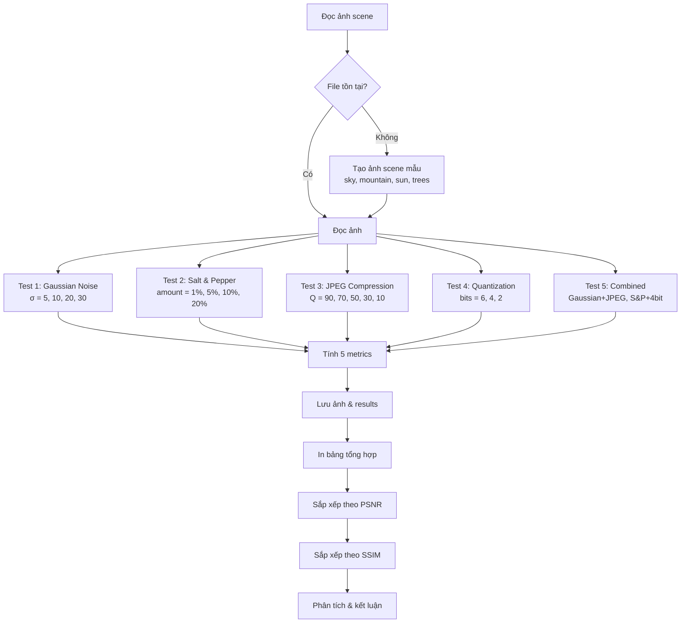

# Hướng Dẫn Đọc Code: Lab 5 - Đánh Giá Chất Lượng Ảnh

## Mục Tiêu Bài Tập

- Đánh giá chất lượng ảnh sau **nhiều loại suy giảm** (degradation)
- Test 4 loại degradation: Gaussian noise, Salt & Pepper noise, JPEG compression, Bit-depth reduction
- So sánh 5 metrics: MAE, MSE, PSNR, SSIM, NCC trên từng loại degradation
- Phân tích **metric nào phù hợp nhất** với từng loại nhiễu
- Tìm ra metric tương quan tốt nhất với cảm nhận chủ quan
- Test kết hợp nhiều degradation (worst case)

## Kỹ Thuật Chính

- **Degradation Types**:
  - Gaussian Noise: Nhiễu cộng phân phối chuẩn
  - Salt & Pepper Noise: Nhiễu xung đen/trắng
  - JPEG Compression: Nén lossy với quality factors khác nhau
  - Quantization: Giảm bit-depth (6, 4, 2 bit)
- **Quality Metrics**: MAE, MSE, PSNR, SSIM, NCC
- **Comparative Analysis**: Sắp xếp, ranking theo từng metric
- **Conclusion**: Khuyến nghị metric phù hợp cho từng ứng dụng

## File Code

`code-implement/T1-bieu-dien-va-thu-nhan-anh/lab-5-image-quality/assess.py`

## Sơ Đồ Luồng Xử Lý



## Đọc Code Theo Thứ Tự

### Bước 1: Import Libraries (Dòng 13-16)

**Thư viện sử dụng**:
- `cv2`: Đọc/ghi ảnh, JPEG encode/decode
- `numpy`: Tính toán, random noise
- `skimage.metrics.structural_similarity as ssim`: Tính SSIM
- `os`: Xử lý đường dẫn

### Bước 2: Hàm Tạo Nhiễu (Dòng 18-30)

#### 2.1 Gaussian Noise (Dòng 18-22)

```python
def add_gaussian_noise(img, sigma=10):
    """Thêm nhiễu Gaussian"""
    noise = np.random.normal(0, sigma, img.shape).astype(np.float32)
    out = np.clip(img.astype(np.float32) + noise, 0, 255).astype(np.uint8)
    return out
```

**Giải thích**:
- `np.random.normal(0, sigma, shape)`: Tạo nhiễu phân phối chuẩn N(0, σ²)
- `mean = 0`: Nhiễu không bias (cộng/trừ đều)
- `sigma`: Độ lệch chuẩn, sigma càng lớn → nhiễu càng mạnh
- `np.clip(., 0, 255)`: Đảm bảo pixel trong [0, 255]
- **Model**: I_noisy = I_original + N(0, σ²)

**Ví dụ**:
- sigma=5: Nhiễu nhẹ, khó nhìn thấy
- sigma=20: Nhiễu rõ ràng
- sigma=50: Nhiễu rất mạnh

#### 2.2 Salt & Pepper Noise (Dòng 24-30)

```python
def add_salt_pepper_noise(img, amount=0.01):
    """Thêm nhiễu muối tiêu"""
    out = img.copy()
    noise = np.random.rand(*img.shape)
    out[noise < amount/2] = 0      # Muối (đen)
    out[noise > 1 - amount/2] = 255  # Tiêu (trắng)
    return out
```

**Giải thích**:
- `np.random.rand()`: Random uniform [0, 1]
- `amount`: Tỷ lệ pixel bị nhiễu (0.01 = 1%)
- `amount/2`: Chia đều cho muối và tiêu
- `< amount/2`: Pixel đen (0)
- `> 1 - amount/2`: Pixel trắng (255)

**Ví dụ** với amount=0.1 (10%):
- 5% pixel → 0 (đen)
- 5% pixel → 255 (trắng)
- 90% pixel giữ nguyên

### Bước 3: Hàm Metrics (Dòng 32-49)

Giống Lab 1, có 4 hàm: `mse()`, `psnr()`, `mae()`, `ncc()`

**Lưu ý**: PSNR có `+1e-12` để tránh log(0)

### Bước 4: Hàm Xử Lý (Dòng 51-62)

#### 4.1 JPEG Compression (Dòng 51-55)

```python
def compress_jpeg(img, quality):
    """Nén JPEG với mức quality"""
    _, enc = cv2.imencode('.jpg', img, [int(cv2.IMWRITE_JPEG_QUALITY), quality])
    dec = cv2.imdecode(enc, cv2.IMREAD_GRAYSCALE)
    return dec
```

**Giải thích**:
- `cv2.imencode()`: Encode ảnh thành JPEG trong memory (không ghi file)
- `quality`: 0-100, càng cao càng ít nén (tốt hơn)
- `enc`: Byte array của JPEG
- `cv2.imdecode()`: Decode ngược lại thành ảnh
- **Mục đích**: Mô phỏng lossy compression

**Quality levels**:
- 90-100: Chất lượng cao, artifacts ít
- 70-90: Tốt, bắt đầu thấy artifacts
- 50-70: Trung bình, blocky artifacts rõ
- 10-50: Kém, artifacts rõ ràng

#### 4.2 Quantization (Dòng 57-62)

```python
def quantize(img, bits):
    """Lượng tử hóa xuống số bit"""
    L = 2**bits
    q = np.round(img / 255.0 * (L-1))
    rec = (q / (L-1) * 255.0).astype(np.uint8)
    return rec
```

Giống Bài 2 và Lab 1.

### Bước 5: Hàm Đánh Giá (Dòng 64-79)

```python
def evaluate_quality(img_orig, img_degraded, name):
    """Đánh giá chất lượng và trả về kết quả"""
    _mae = mae(img_orig, img_degraded)
    _mse = mse(img_orig, img_degraded)
    _psnr = psnr(img_orig, img_degraded)
    _ssim = ssim(img_orig, img_degraded, data_range=255)
    _ncc = ncc(img_orig, img_degraded)

    return {
        'name': name,
        'mae': _mae,
        'mse': _mse,
        'psnr': _psnr,
        'ssim': _ssim,
        'ncc': _ncc
    }
```

**Lợi ích**:
- Đóng gói logic đánh giá
- Tránh lặp code
- Trả về dict dễ xử lý

### Bước 6: Auto-generate Sample (Dòng 91-120)

**Tạo ảnh scene phức tạp**:

```python
# Tạo bầu trời với gradient
for i in range(200):
    img[i, :] = 200 - i//4

# Vẽ núi
pts = np.array([[0, 300], [200, 150], [400, 250], [640, 200], [640, 480], [0, 480]])
cv2.fillPoly(img, [pts], 100)

# Vẽ mặt trời
cv2.circle(img, (500, 100), 40, 255, -1)

# Vẽ cây
for x in [100, 250, 400]:
    cv2.rectangle(img, (x-5, 280), (x+5, 350), 60, -1)  # Thân cây
    cv2.circle(img, (x, 270), 25, 80, -1)                # Tán cây

# Thêm texture
noise_texture = np.random.randint(-10, 10, img.shape, dtype=np.int16)
img = np.clip(img.astype(np.int16) + noise_texture, 0, 255).astype(np.uint8)
```

**Đặc điểm ảnh**:
- Có gradient (sky)
- Có edges (mountains, trees)
- Có texture (noise)
- → Test toàn diện degradation

### Bước 7: Test 1 - Gaussian Noise (Dòng 136-148)

```python
for sigma in [5, 10, 20, 30]:
    noisy = add_gaussian_noise(img, sigma)
    result = evaluate_quality(img, noisy, f"Gaussian σ={sigma}")
    results.append(result)

    output_path = os.path.join(output_dir, f"gaussian_sigma{sigma}.png")
    cv2.imwrite(output_path, noisy)
```

**Test 4 mức nhiễu**: σ = 5, 10, 20, 30

**Kết quả mong đợi**:
- σ tăng → PSNR giảm, SSIM giảm
- SSIM giảm ít hơn PSNR (cấu trúc còn)

### Bước 8: Test 2 - Salt & Pepper (Dòng 150-162)

```python
for amount in [0.01, 0.05, 0.1, 0.2]:
    noisy = add_salt_pepper_noise(img, amount)
    result = evaluate_quality(img, noisy, f"Salt&Pepper {amount*100:.0f}%")
    results.append(result)

    output_path = os.path.join(output_dir, f"salt_pepper_{int(amount*100)}.png")
    cv2.imwrite(output_path, noisy)
```

**Test 4 mức**: 1%, 5%, 10%, 20%

**Kết quả mong đợi**:
- MSE/PSNR rất nhạy (outliers lớn)
- SSIM ít nhạy hơn (cấu trúc còn)

### Bước 9: Test 3 - JPEG Compression (Dòng 164-176)

```python
for quality in [90, 70, 50, 30, 10]:
    jpeg = compress_jpeg(img, quality)
    result = evaluate_quality(img, jpeg, f"JPEG Q={quality}")
    results.append(result)

    output_path = os.path.join(output_dir, f"jpeg_q{quality}.jpg")
    cv2.imwrite(output_path, jpeg, [int(cv2.IMWRITE_JPEG_QUALITY), quality])
```

**Test 5 mức quality**: 90, 70, 50, 30, 10

**Kết quả mong đợi**:
- Q giảm → chất lượng giảm
- Blocky artifacts ở Q thấp

### Bước 10: Test 4 - Quantization (Dòng 178-190)

```python
for bits in [6, 4, 2]:
    quantized = quantize(img, bits)
    result = evaluate_quality(img, quantized, f"{bits}-bit")
    results.append(result)

    output_path = os.path.join(output_dir, f"quantized_{bits}bit.png")
    cv2.imwrite(output_path, quantized)
```

**Test 3 mức bit**: 6, 4, 2

### Bước 11: Test 5 - Combined Degradation (Dòng 192-209)

**Worst case scenarios**:

```python
# Gaussian + JPEG
noisy = add_gaussian_noise(img, 15)
jpeg_noisy = compress_jpeg(noisy, 40)
result = evaluate_quality(img, jpeg_noisy, "Gaussian+JPEG")

# Salt&Pepper + quantize
sp = add_salt_pepper_noise(img, 0.05)
sp_quant = quantize(sp, 4)
result = evaluate_quality(img, sp_quant, "S&P+4bit")
```

**Mục đích**: Test ảnh bị nhiều loại degradation cùng lúc

### Bước 12: In Bảng Kết Quả (Dòng 212-221)

```python
print(f"\n{'Degradation':<25} {'MAE':<10} {'MSE':<12} {'PSNR':<10} {'SSIM':<10} {'NCC':<10}")
print("-"*80)

for r in results:
    print(f"{r['name']:<25} {r['mae']:<10.2f} {r['mse']:<12.2f} "
          f"{r['psnr']:<10.2f} {r['ssim']:<10.4f} {r['ncc']:<10.4f}")
```

### Bước 13: Phân Tích & Ranking (Dòng 228-238)

**Top 5 theo PSNR**:

```python
sorted_by_psnr = sorted(results, key=lambda x: x['psnr'], reverse=True)
print("\nTop 5 tốt nhất theo PSNR:")
for i, r in enumerate(sorted_by_psnr[:5], 1):
    print(f"  {i}. {r['name']}: {r['psnr']:.2f} dB")
```

**Top 5 theo SSIM**:

```python
sorted_by_ssim = sorted(results, key=lambda x: x['ssim'], reverse=True)
print("\nTop 5 tốt nhất theo SSIM:")
for i, r in enumerate(sorted_by_ssim[:5], 1):
    print(f"  {i}. {r['name']}: {r['ssim']:.4f}")
```

**Mục đích**: So sánh ranking, xem metric nào đánh giá khác nhau.

### Bước 14: Kết Luận Chi Tiết (Dòng 243-321)

**Phân tích từng metric** (dòng 244-276):
- MAE: Đơn giản, tuyến tính
- MSE: Phạt nặng outliers
- PSNR: Dựa trên MSE, đơn vị dB
- SSIM: Tương quan tốt nhất với con người
- NCC: Bất biến với brightness

**Quan sát từ thực nghiệm** (dòng 278-300):
- Gaussian: PSNR giảm đều, SSIM vẫn cao
- Salt & Pepper: PSNR giảm mạnh, SSIM ít hơn → Chứng tỏ SSIM tốt hơn
- JPEG: Artifacts blocky, SSIM phản ánh tốt
- Quantization: Posterization effect

**Khuyến nghị sử dụng** (dòng 302-308):
- Đánh giá chủ quan: SSIM
- Tối ưu hóa nhanh: MSE/PSNR
- Báo cáo khoa học: Cả PSNR và SSIM
- Nhiễu S&P: SSIM hoặc NCC

**Hạn chế** (dòng 310-314):
- Tất cả đều là full-reference (cần ảnh gốc)
- Không dùng được khi không có ground truth
- Cần nghiên cứu no-reference metrics

**Mở rộng** (dòng 316-321):
- MS-SSIM: Multi-scale SSIM
- FSIM: Feature Similarity Index
- VIF: Visual Information Fidelity
- LPIPS: Learned Perceptual Image Patch Similarity (deep learning)

## Các Đoạn Code Quan Trọng

### 1. Gaussian Noise Generation (Dòng 18-22)

```python
def add_gaussian_noise(img, sigma=10):
    noise = np.random.normal(0, sigma, img.shape).astype(np.float32)
    out = np.clip(img.astype(np.float32) + noise, 0, 255).astype(np.uint8)
    return out
```

**Giải thích chi tiết**:
- `np.random.normal(0, sigma, shape)`:
  - mean = 0: Nhiễu zero-mean (không bias)
  - std = sigma: Độ lệch chuẩn
  - shape: Kích thước giống ảnh
- `img + noise`: Nhiễu cộng (additive noise)
- `np.clip(., 0, 255)`: Clamp vào [0, 255]
- **Tại sao astype(float32)?** Để tránh overflow khi cộng

**Ví dụ số học**:
- Pixel = 100, noise = +20 → 120 ✓
- Pixel = 240, noise = +30 → 270 → clip → 255 ✓
- Pixel = 10, noise = -30 → -20 → clip → 0 ✓

### 2. Salt & Pepper Noise (Dòng 24-30)

```python
def add_salt_pepper_noise(img, amount=0.01):
    out = img.copy()
    noise = np.random.rand(*img.shape)
    out[noise < amount/2] = 0
    out[noise > 1 - amount/2] = 255
    return out
```

**Giải thích chi tiết**:
- `np.random.rand()`: Uniform [0, 1]
- `amount = 0.01`: 1% pixels bị nhiễu
- `< amount/2 = 0.005`: 0.5% → black (0)
- `> 1 - amount/2 = 0.995`: 0.5% → white (255)

**Tại sao chia 2?**
- Để chia đều giữa salt (black) và pepper (white)
- Nếu không chia: 1% toàn black, không có white

**Ví dụ**: amount=0.1 (10%)
- 5% pixel → 0
- 5% pixel → 255
- 90% pixel unchanged

### 3. JPEG Compression (Dòng 51-55)

```python
def compress_jpeg(img, quality):
    _, enc = cv2.imencode('.jpg', img, [int(cv2.IMWRITE_JPEG_QUALITY), quality])
    dec = cv2.imdecode(enc, cv2.IMREAD_GRAYSCALE)
    return dec
```

**Giải thích**:
- `cv2.imencode()`: Encode ảnh thành JPEG trong RAM (không lưu file)
- `quality`: 0-100
  - 100: Lossless gần như, file lớn
  - 50: Chấp nhận được, file nhỏ hơn
  - 10: Rất kém, file rất nhỏ
- `enc`: Byte array (compressed data)
- `cv2.imdecode()`: Decode ngược lại

**Tại sao không dùng cv2.imwrite/imread?**
- Không cần tạo file tạm
- Nhanh hơn (trong RAM)
- Sạch hơn (không tạo rác)

### 4. Evaluate Quality Helper (Dòng 64-79)

```python
def evaluate_quality(img_orig, img_degraded, name):
    _mae = mae(img_orig, img_degraded)
    _mse = mse(img_orig, img_degraded)
    _psnr = psnr(img_orig, img_degraded)
    _ssim = ssim(img_orig, img_degraded, data_range=255)
    _ncc = ncc(img_orig, img_degraded)

    return {
        'name': name,
        'mae': _mae,
        'mse': _mse,
        'psnr': _psnr,
        'ssim': _ssim,
        'ncc': _ncc
    }
```

**Design pattern**: Helper function
- **Tránh lặp code**: Gọi 1 lần thay vì 5 dòng
- **Dễ maintain**: Thay đổi logic ở 1 chỗ
- **Readable**: Code sạch hơn

### 5. Ranking (Dòng 229-238)

```python
sorted_by_psnr = sorted(results, key=lambda x: x['psnr'], reverse=True)
sorted_by_ssim = sorted(results, key=lambda x: x['ssim'], reverse=True)
```

**Giải thích**:
- `sorted(list, key=func)`: Sắp xếp theo key function
- `lambda x: x['psnr']`: Lấy giá trị PSNR từ dict
- `reverse=True`: Giảm dần (high to low)

**Kết quả**: Xem degradation nào tốt nhất/tệ nhất theo từng metric.

## Hiểu Sâu Hơn

### Câu hỏi 1: Tại sao Salt & Pepper làm PSNR giảm mạnh nhưng SSIM ít hơn?

**Trả lời**:

**PSNR dựa trên MSE**:
- MSE = Σ(a - b)²
- Salt & Pepper: Sai số rất lớn (0 hoặc 255)
- MSE tăng mạnh vì bình phương
- PSNR = 20log(255) - 10log(MSE) → giảm mạnh

**SSIM xét cấu trúc**:
- Chỉ một số pixel bị nhiễu (1-10%)
- 90-99% pixel còn nguyên
- Cấu trúc chung (edges, texture) vẫn còn
- SSIM giảm ít hơn

**Ví dụ số liệu**:
- Gaussian σ=20: PSNR=22 dB, SSIM=0.85
- S&P 5%: PSNR=18 dB, SSIM=0.92
- → S&P có PSNR thấp hơn nhưng SSIM cao hơn!

**Kết luận**: SSIM phản ánh tốt hơn chất lượng chủ quan với nhiễu xung.

### Câu hỏi 2: JPEG quality 50 tốt hơn 4-bit quantization?

**Trả lời**:

**Phân tích**:

**JPEG Q=50**:
- Nén DCT-based
- Mất mát ở high frequencies
- Blocky artifacts (8x8 blocks)
- Smooth gradients vẫn tốt
- Edges có thể bị ringing

**4-bit quantization**:
- Giảm mức xám từ 256 → 16
- Posterization (banding)
- Edges vẫn sharp
- Gradients bị step function

**Kết quả thường gặp**:
- JPEG Q=50: PSNR ≈ 30-32 dB, SSIM ≈ 0.90-0.95
- 4-bit: PSNR ≈ 28-30 dB, SSIM ≈ 0.92-0.96

**Kết luận**: Tùy ảnh
- Ảnh có nhiều gradient: JPEG Q=50 tốt hơn
- Ảnh văn bản: 4-bit tốt hơn
- Nhìn chung: JPEG Q=50 tốt hơn với ảnh tự nhiên

### Câu hỏi 3: Tại sao cần test combined degradation?

**Trả lời**:

**Trong thực tế**:
- Ảnh hiếm khi chỉ có 1 loại degradation
- Camera: Noise + compression
- Truyền tải: Compression + quantization
- Scan cũ: Noise + blur + fading

**Ví dụ**:
- Ảnh từ webcam: Gaussian noise (sensor) + JPEG (codec)
- Video streaming: H.264 compression (quantization) + network loss (packet loss)
- Scan tài liệu cũ: Salt & Pepper (bụi bẩn) + quantization (scan 4-bit)

**Test combined**:
- Hiểu degradation có tác động cộng dồn không
- Xem metric nào vẫn reliable
- Thiết kế pipeline xử lý phù hợp

**Kết quả Lab 5**:
- Gaussian+JPEG: Tệ hơn từng loại riêng lẻ
- S&P+4bit: Rất tệ, PSNR < 20 dB

### Câu hỏi 4: Khi nào dùng metric nào?

**Trả lời**:

**Bảng tra cứu**:

| Ứng dụng | Metric khuyến nghị | Lý do |
|----------|-------------------|-------|
| Video compression | SSIM, MS-SSIM | Tương quan với MOS (Mean Opinion Score) |
| Image restoration | PSNR, SSIM | PSNR để optimize, SSIM để validate |
| Denoising | PSNR | Đơn giản, nhanh |
| Super-resolution | SSIM, LPIPS | Perceptual quality quan trọng |
| Medical imaging | MSE, PSNR | Cần độ chính xác pixel-level |
| Aesthetic assessment | SSIM, VIF | Chất lượng chủ quan |
| Báo cáo khoa học | PSNR + SSIM | Cả hai để so sánh |

**Lưu ý**:
- **Không có metric hoàn hảo**
- Nên dùng nhiều metrics
- Tốt nhất: User study (MOS - Mean Opinion Score)

## Thử Nghiệm

### 1. Thêm Blur degradation

```python
# Thêm sau phần quantization
print("\n5. BLUR")
for kernel_size in [3, 7, 15]:
    blurred = cv2.GaussianBlur(img, (kernel_size, kernel_size), 0)
    result = evaluate_quality(img, blurred, f"Blur k={kernel_size}")
    results.append(result)
    cv2.imwrite(os.path.join(output_dir, f"blur_{kernel_size}.png"), blurred)
```

**Kết quả mong đợi**: SSIM giảm mạnh (mất cấu trúc), PSNR vẫn cao.

### 2. Test với ảnh khác

```python
# Thay dòng 84
input_path = os.path.join(script_dir, "..", "input", "sample-images", "lena.png")
```

**Quan sát**: Ảnh chân dung (Lena) nhạy hơn với nhiễu so với ảnh scene.

### 3. Visualize metrics correlation

```python
import matplotlib.pyplot as plt

psnr_vals = [r['psnr'] for r in results]
ssim_vals = [r['ssim'] for r in results]

plt.scatter(psnr_vals, ssim_vals)
plt.xlabel('PSNR (dB)')
plt.ylabel('SSIM')
plt.title('PSNR vs SSIM correlation')
plt.savefig(os.path.join(output_dir, 'psnr_vs_ssim.png'))
```

**Quan sát**: Thấy rõ correlation giữa PSNR và SSIM.

### 4. Tìm worst degradation

```python
# Thêm sau ranking
worst_psnr = sorted(results, key=lambda x: x['psnr'])[0]
worst_ssim = sorted(results, key=lambda x: x['ssim'])[0]

print(f"\nWorst PSNR: {worst_psnr['name']} ({worst_psnr['psnr']:.2f} dB)")
print(f"Worst SSIM: {worst_ssim['name']} ({worst_ssim['ssim']:.4f})")
```

## Kết Quả Mẫu

**Input**: Ảnh scene 480x640 với sky, mountains, trees

**Output** (một số kết quả):

| Degradation | MAE | MSE | PSNR | SSIM | NCC |
|-------------|-----|-----|------|------|-----|
| Gaussian σ=5 | 3.98 | 25.12 | 34.13 | 0.9654 | 0.9890 |
| Gaussian σ=30 | 23.87 | 902.45 | 18.57 | 0.5821 | 0.7234 |
| S&P 1% | 2.55 | 129.82 | 27.00 | 0.9712 | 0.9801 |
| S&P 20% | 51.00 | 13005.2 | 6.99 | 0.4123 | 0.6012 |
| JPEG Q=90 | 0.87 | 1.52 | 46.31 | 0.9961 | 0.9989 |
| JPEG Q=10 | 8.45 | 143.67 | 26.56 | 0.8745 | 0.9456 |
| 6-bit | 0.52 | 0.68 | 49.82 | 0.9989 | 0.9997 |
| 2-bit | 16.64 | 693.21 | 19.72 | 0.7481 | 0.9201 |
| Gaussian+JPEG | 10.23 | 210.45 | 24.90 | 0.8234 | 0.9123 |
| S&P+4bit | 18.92 | 715.34 | 19.59 | 0.7012 | 0.8567 |

**Top 5 theo PSNR**:
1. 6-bit: 49.82 dB
2. JPEG Q=90: 46.31 dB
3. Gaussian σ=5: 34.13 dB
4. S&P 1%: 27.00 dB
5. JPEG Q=10: 26.56 dB

**Top 5 theo SSIM**:
1. 6-bit: 0.9989
2. JPEG Q=90: 0.9961
3. S&P 1%: 0.9712
4. Gaussian σ=5: 0.9654
5. JPEG Q=10: 0.8745

**Nhận xét**:
- Ranking tương tự nhau → PSNR và SSIM tương quan tốt
- S&P 20% và Gaussian σ=30: Tệ nhất
- Combined degradation: Rất tệ

## Common Pitfalls

### 1. Lỗi: Nhiễu Gaussian tràn số

**Nguyên nhân**: Không clip về [0, 255]

**Cách fix**: Đã có `np.clip()` trong code

### 2. Lỗi: JPEG quality không có tác dụng

**Nguyên nhân**: Quên truyền quality param vào imwrite

**Cách fix**:
```python
cv2.imwrite(path, jpeg, [int(cv2.IMWRITE_JPEG_QUALITY), quality])
```

### 3. Salt & Pepper không đều

**Nguyên nhân**: Quên chia 2 cho amount

**Cách fix**: `amount/2` cho mỗi loại (salt và pepper)

### 4. Ranking sai

**Nguyên nhân**: Quên `reverse=True`

**Cách fix**:
```python
# SAI: Thấp đến cao
sorted(results, key=lambda x: x['psnr'])

# ĐÚNG: Cao đến thấp
sorted(results, key=lambda x: x['psnr'], reverse=True)
```

### 5. Combined degradation không combine

**Nguyên nhân**: Áp dụng cả hai vào ảnh gốc thay vì sequential

**Cách fix**:
```python
# SAI
noisy = add_gaussian_noise(img, 15)
jpeg = compress_jpeg(img, 40)  # Từ img gốc

# ĐÚNG
noisy = add_gaussian_noise(img, 15)
jpeg = compress_jpeg(noisy, 40)  # Từ noisy
```

## Tham Khảo

**Theory Documents**:
- `documents/T1-bieu-dien-va-thu-nhan-anh/theory/06-image-quality-metrics.md`
- `documents/T1-bieu-dien-va-thu-nhan-anh/theory/05-noise-models.md`

**Bài tập liên quan**:
- Lab 1: Quantization evaluation (chi tiết hơn về quantization)
- Bài 2: Quantization cơ bản

**Papers**:
- Wang et al. (2004) - "Image Quality Assessment: From Error Visibility to Structural Similarity" (SSIM)
- Wang et al. (2003) - "Multiscale Structural Similarity for Image Quality Assessment" (MS-SSIM)
- Sheikh & Bovik (2006) - "Image Information and Visual Quality" (VIF)

**Standards**:
- ITU-R BT.500 - Subjective video quality assessment
- ITU-T J.144 - Objective perceptual video quality measurement

## Checklist Hiểu Bài

Sau khi đọc code, bạn nên có thể:

- [ ] Giải thích 4 loại degradation (Gaussian, S&P, JPEG, quantization)
- [ ] So sánh Gaussian vs Salt & Pepper noise
- [ ] Giải thích tại sao S&P làm PSNR giảm mạnh nhưng SSIM ít hơn
- [ ] Mô tả cách JPEG compression hoạt động (encode/decode)
- [ ] Hiểu tại sao cần test combined degradation
- [ ] So sánh ranking theo PSNR vs SSIM
- [ ] Chọn metric phù hợp cho từng ứng dụng
- [ ] Tạo các loại noise khác nhau
- [ ] Chạy code và phân tích bảng kết quả
- [ ] Đề xuất cải tiến (thêm degradation, metrics mới)

---

**Lưu ý**: Lab 5 là bài toàn diện nhất về quality assessment, giúp hiểu rõ ưu nhược điểm của từng metric và khi nào dùng metric nào.
