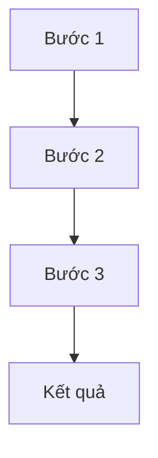

# REQ-6: Hoàn thiện Documents cho T1 - Biểu diễn và Thu nhận Ảnh

## 📋 Mục Tiêu

Bổ sung và hoàn thiện tài liệu cho `T1-bieu-dien-va-thu-nhan-anh` để đạt chuẩn theo template của REQ-5:
- ✅ Tạo đầy đủ **code-reading-guide** cho 10 bài (5 bài tập + 5 lab)
- ✅ Bổ sung chi tiết cho các **theory files** hiện có
- ✅ Đảm bảo documents đầy đủ và dễ hiểu

## 🎯 Vấn Đề Hiện Tại

### 1. Thiếu Code-Reading-Guide
```
documents/T1-bieu-dien-va-thu-nhan-anh/
├── theory/                     ✅ CÓ (6 files)
├── code-reading-guide/         ❌ CHƯA CÓ (cần tạo)
└── README.md                   ✅ CÓ
```

**Vấn đề**:
- Không có hướng dẫn đọc code chi tiết cho từng bài
- Người học khó hiểu code một cách nhanh chóng
- Thiếu sự kết nối giữa theory và code implementation

### 2. Theory Files Chưa Đủ Chi Tiết
**Vấn đề**:
- Một số theory files chưa có đủ code examples
- Thiếu phần "Best Practices"
- Chưa có phần "Common Pitfalls" và troubleshooting
- Thiếu bài tập thực hành ở cuối mỗi theory file

## 📦 DANH SÁCH CÔNG VIỆC

### Task 1: Tạo Code-Reading-Guide (10 files)

**Folder**: `documents/T1-bieu-dien-va-thu-nhan-anh/code-reading-guide/`

#### Danh sách files cần tạo:

**Bài tập (5 files):**
1. `bai-1-how-to-read.md` - Camera Storage Calculator
2. `bai-2-how-to-read.md` - Quantization
3. `bai-3-how-to-read.md` - Bit-plane Slicing
4. `bai-4-how-to-read.md` - Connectivity & Pathfinding
5. `bai-5-how-to-read.md` - Color Space & Skin Detection

**Lab (5 files):**
6. `lab-1-how-to-read.md` - Quantization Evaluation
7. `lab-2-how-to-read.md` - Zooming & Shrinking
8. `lab-3-how-to-read.md` - Circle Measurement
9. `lab-4-how-to-read.md` - Connected Components Labeling
10. `lab-5-how-to-read.md` - Image Quality Assessment

#### Template cho Code-Reading-Guide

```markdown
# Hướng Dẫn Đọc Code: [Tên Bài]

## 📖 Mục Tiêu Bài Tập
- [Liệt kê 2-4 mục tiêu chính]

## 🎯 Kỹ Thuật Chính
- **Kỹ thuật 1**: [Giải thích ngắn gọn]
- **Kỹ thuật 2**: [Giải thích ngắn gọn]

## 📂 File Code
`[đường dẫn tới file .py]`

## 🗺️ Sơ Đồ Luồng Xử Lý



## 📝 Đọc Code Theo Thứ Tự

### Bước 1: Import và Setup (Dòng XX-YY)
**Mục đích**: [Giải thích]
**Thư viện sử dụng**:
- `library1`: [Tại sao cần]
- `library2`: [Tại sao cần]

### Bước 2: Hàm Xử Lý Chính (Dòng XX-YY)
**Tên hàm**: `function_name()`
**Input**: [Mô tả]
**Output**: [Mô tả]
**Thuật toán**:
1. [Bước 1]
2. [Bước 2]
3. [Bước 3]

**Code quan trọng**:
```python
[Code snippet]
```
**Giải thích**: [Tại sao làm vậy]

### Bước 3: Main Execution (Dòng XX-YY)
- **Thiết lập đường dẫn**: [Giải thích]
- **Đọc ảnh**: [Giải thích]
- **Xử lý**: [Giải thích]
- **Lưu kết quả**: [Giải thích]

## 🔍 Các Đoạn Code Quan Trọng

### 1. [Tên đoạn code] (dòng XX-YY)
```python
[Code snippet]
```
**Giải thích chi tiết**:
- Dòng X: [Giải thích]
- Dòng Y: [Giải thích]

### 2. [Tên đoạn code] (dòng XX-YY)
[Tương tự]

## 💡 Hiểu Sâu Hơn

### ❓ Câu hỏi 1: [Câu hỏi]
**Trả lời**: [Giải thích chi tiết]

### ❓ Câu hỏi 2: [Câu hỏi]
**Trả lời**: [Giải thích chi tiết]

### ❓ Câu hỏi 3: [Câu hỏi]
**Trả lời**: [Giải thích chi tiết]

## 🧪 Thử Nghiệm

**Để hiểu rõ hơn, hãy thử**:
1. **Thay đổi [parameter X]**: [Mô tả kết quả mong đợi]
2. **Thử với [input khác]**: [Mô tả kết quả]
3. **Comment dòng [Y]**: [Xem ảnh hưởng gì]

## 📊 Kết Quả Mẫu

**Input**: [Mô tả]
**Output**: [Mô tả]
**Metrics**: [Nếu có]

## 🐛 Common Pitfalls

1. **Lỗi 1**: [Mô tả]
   - **Nguyên nhân**: [Giải thích]
   - **Cách fix**: [Hướng dẫn]

2. **Lỗi 2**: [Mô tả]
   - **Nguyên nhân**: [Giải thích]
   - **Cách fix**: [Hướng dẫn]

## 📚 Tham Khảo

**Theory Documents**:
- `documents/T1-bieu-dien-va-thu-nhan-anh/theory/[file].md`

**OpenCV Documentation**:
- [Link tới docs]

**Bài tập liên quan**:
- [Liệt kê các bài liên quan]

## ✅ Checklist Hiểu Bài

Sau khi đọc code, bạn nên có thể:
- [ ] Giải thích mục tiêu của bài tập
- [ ] Mô tả thuật toán chính
- [ ] Hiểu tại sao chọn kỹ thuật này
- [ ] Chạy được code và giải thích output
- [ ] Thay đổi parameters và dự đoán kết quả
```

### Task 2: Bổ Sung Theory Files (6 files)

**Folder**: `documents/T1-bieu-dien-va-thu-nhan-anh/theory/`

Bổ sung cho các files hiện có:

1. **`01-sampling-quantization.md`**
   - ➕ Thêm code examples chi tiết hơn
   - ➕ Thêm phần "Common Pitfalls"
   - ➕ Thêm phần "Best Practices"
   - ➕ Thêm bài tập thực hành cuối file

2. **`02-bit-plane-representation.md`**
   - ➕ Thêm code examples
   - ➕ Thêm ví dụ ứng dụng steganography
   - ➕ Thêm visualization examples

3. **`03-pixel-connectivity.md`**
   - ➕ Thêm code examples cho BFS/DFS
   - ➕ Thêm so sánh chi tiết 4-conn vs 8-conn
   - ➕ Thêm edge cases và cách xử lý

4. **`04-color-spaces.md`**
   - ➕ Thêm code examples cho conversion
   - ➕ Thêm ví dụ skin detection chi tiết
   - ➕ Thêm comparison table

5. **`05-image-interpolation.md`**
   - ➕ Thêm code examples cho từng method
   - ➕ Thêm visual comparison
   - ➕ Thêm performance benchmarks

6. **`06-image-quality-metrics.md`**
   - ➕ Thêm code examples cho từng metric
   - ➕ Thêm interpretation guide
   - ➕ Thêm when to use which metric

#### Cấu Trúc Hoàn Chỉnh Cho Theory Files

```markdown
# [Tên Chủ Đề]

## 📋 Mục Lục
- [Auto-generated]

## 1. Giới Thiệu
[Tổng quan về chủ đề]

## 2. Khái Niệm Cơ Bản

### 2.1 Định nghĩa
[Định nghĩa chính xác]

### 2.2 Công thức
[Công thức toán học nếu có]

### 2.3 Đặc điểm
- **Ưu điểm**: [Liệt kê]
- **Nhược điểm**: [Liệt kê]

## 3. Phân Loại / Các Phương Pháp

### 3.1 Phương pháp 1
[Giải thích chi tiết]

### 3.2 Phương pháp 2
[Giải thích chi tiết]

## 4. Code Examples

### 4.1 Example 1: [Tên]
```python
[Code đầy đủ có thể chạy được]
```
**Giải thích**: [Chi tiết từng bước]
**Output**: [Mô tả kết quả]

### 4.2 Example 2: [Tên]
[Tương tự]

## 5. Ứng Dụng Thực Tế

### 5.1 Ứng dụng 1
[Mô tả cụ thể]

### 5.2 Ứng dụng 2
[Mô tả cụ thể]

## 6. Best Practices

### ✅ Nên làm
1. [Item 1]
2. [Item 2]

### ❌ Không nên làm
1. [Item 1]
2. [Item 2]

### 💡 Tips
- [Tip 1]
- [Tip 2]

## 7. Common Pitfalls

### Lỗi 1: [Tên lỗi]
**Vấn đề**: [Mô tả]
**Nguyên nhân**: [Giải thích]
**Giải pháp**: [Hướng dẫn fix]

### Lỗi 2: [Tên lỗi]
[Tương tự]

## 8. So Sánh

[Bảng so sánh các phương pháp nếu có nhiều phương pháp]

| Tiêu chí | Phương pháp 1 | Phương pháp 2 |
|----------|---------------|---------------|
| Speed    | [Đánh giá]    | [Đánh giá]    |
| Quality  | [Đánh giá]    | [Đánh giá]    |
| ...      | ...           | ...           |

## 9. Bài Tập Thực Hành

### Bài 1: [Tên]
**Mô tả**: [Yêu cầu]
**Gợi ý**: [Hướng dẫn]

### Bài 2: [Tên]
[Tương tự]

## 10. Tóm Tắt

**Các điểm chính**:
- [Point 1]
- [Point 2]
- [Point 3]

**Khi nào sử dụng**: [Hướng dẫn]

## 11. Tham Khảo

**Sách**:
- [Citation 1]
- [Citation 2]

**Papers**:
- [Citation 1]

**Online Resources**:
- [Link 1]
- [Link 2]

**Code Implementation**:
- Tham khảo code trong `code-implement/T1-bieu-dien-va-thu-nhan-anh/`
```

## 🔄 QUY TRÌNH THỰC HIỆN

### Giai đoạn 1: Tạo Code-Reading-Guide
1. ✅ Tạo folder `code-reading-guide/`
2. ✅ Đọc từng file code để hiểu rõ
3. ✅ Tạo 10 files hướng dẫn đọc code
4. ✅ Đảm bảo link đúng tới code và theory

### Giai đoạn 2: Bổ Sung Theory Files
1. ✅ Đọc lại các theory files hiện có
2. ✅ Bổ sung code examples
3. ✅ Bổ sung best practices và common pitfalls
4. ✅ Bổ sung bài tập thực hành

### Giai đoạn 3: Review và Liên Kết
1. ✅ Review toàn bộ documents
2. ✅ Đảm bảo links giữa theory ↔ code-reading-guide ↔ code
3. ✅ Update README.md nếu cần

## 📝 YÊU CẦU CHI TIẾT

### 1. Về Code-Reading-Guide
- ⚠️ **Phải dễ hiểu**: Người mới học cũng hiểu được
- ⚠️ **Có số dòng cụ thể**: Giúp tìm code nhanh
- ⚠️ **Có flowchart**: Visual learning
- ⚠️ **Có phần "Hiểu sâu hơn"**: Q&A format
- ⚠️ **Có phần "Thử nghiệm"**: Hands-on learning
- ⚠️ **Có checklist**: Self-assessment

### 2. Về Theory Files
- ⚠️ **Code examples phải chạy được**: Copy-paste là chạy
- ⚠️ **Best practices cụ thể**: Không chung chung
- ⚠️ **Common pitfalls thực tế**: Từ experience
- ⚠️ **Bài tập thực hành có gợi ý**: Không quá khó

### 3. Về Ngôn Ngữ
- ✅ **Tiếng Việt**: Dễ hiểu, rõ ràng
- ✅ **Thuật ngữ chuyên ngành**: Giữ nguyên tiếng Anh
- ✅ **Code**: Comments tiếng Việt

## 🎯 KẾT QUẢ MONG ĐỢI

Sau khi hoàn thành req-6:

✅ **Code-Reading-Guide**:
- 10 files hướng dẫn đọc code chi tiết
- Mỗi file 500-800 dòng, đầy đủ thông tin
- Có flowchart, code snippets, Q&A

✅ **Theory Files**:
- 6 files theory được bổ sung đầy đủ
- Có code examples chạy được
- Có best practices và common pitfalls
- Có bài tập thực hành

✅ **Liên Kết**:
- Theory ↔ Code-Reading-Guide ↔ Code implementation
- Người học có thể dễ dàng navigate giữa các tài liệu

✅ **Người học có thể**:
- Đọc theory để hiểu khái niệm
- Đọc code-reading-guide để hiểu code nhanh
- Chạy code và thực hành ngay
- Tự đánh giá mức độ hiểu thông qua checklist

## 📊 ĐỘ ƯU TIÊN

### High Priority (Làm trước)
1. ⭐⭐⭐⭐⭐ Code-reading-guide cho **Bài 2** (Quantization) - Quan trọng nhất
2. ⭐⭐⭐⭐⭐ Code-reading-guide cho **Lab 1** (Quantization Eval)
3. ⭐⭐⭐⭐⭐ Code-reading-guide cho **Lab 5** (Image Quality)
4. ⭐⭐⭐⭐ Bổ sung **theory 06** (Image Quality Metrics)
5. ⭐⭐⭐⭐ Bổ sung **theory 01** (Sampling & Quantization)

### Medium Priority
6. ⭐⭐⭐ Code-reading-guide cho **Bài 3** (Bit-plane)
7. ⭐⭐⭐ Code-reading-guide cho **Bài 5** (Color Space)
8. ⭐⭐⭐ Code-reading-guide cho **Lab 2** (Zooming)
9. ⭐⭐⭐ Bổ sung **theory 04** (Color Spaces)
10. ⭐⭐⭐ Bổ sung **theory 05** (Interpolation)

### Low Priority (Làm sau)
11. ⭐⭐ Code-reading-guide cho **Bài 1** (Calculator)
12. ⭐⭐ Code-reading-guide cho **Bài 4** (Connectivity)
13. ⭐⭐ Code-reading-guide cho **Lab 3** (Circle)
14. ⭐⭐ Code-reading-guide cho **Lab 4** (Connected Components)
15. ⭐⭐ Bổ sung **theory 02, 03**

## 🚀 CÁCH THỰC HIỆN

### Mode Liên Tục (Không Hỏi Xác Nhận)
Thực hiện tất cả tasks theo thứ tự ưu tiên, không cần hỏi user giữa chừng:

1. Tạo folder `code-reading-guide/`
2. Lần lượt tạo 10 files code-reading-guide (theo priority)
3. Lần lượt bổ sung 6 theory files (theo priority)
4. Update README.md nếu cần

### Định Dạng Output
- Mỗi file markdown format chuẩn
- Có table of contents
- Có syntax highlighting
- Có mermaid diagrams (nếu có)

## 📚 THAM KHẢO

- **Template**: REQ-5 section 9 (Code-Reading-Guide template)
- **Mẫu code**: `code-implement/T1-bieu-dien-va-thu-nhan-anh/`
- **Theory hiện có**: `documents/T1-bieu-dien-va-thu-nhan-anh/theory/`

---

**Lưu ý**: Thực hiện theo mode liên tục, tạo hết tất cả files mà không cần hỏi xác nhận từng bước.
